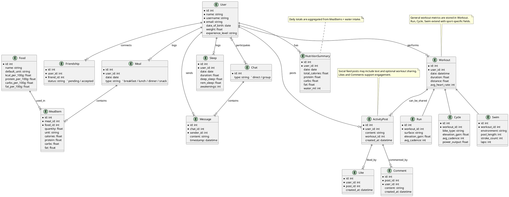

## Domain Model

```plantuml

@startuml

entity User {
  *id: int
  *name: string
  *username: string
  *email: string
  date_of_birth: date
  weight: float
  experience_level: string
}

entity Workout {
  *id: int
  *user_id: int
  date: datetime
  duration: float
  distance: float
  avg_heart_rate: int
}

entity Run {
  *id: int
  *workout_id: int
  surface: string
  elevation_gain: float
  avg_cadence: int
}

entity Cycle {
  *id: int
  *workout_id: int
  bike_type: string
  elevation_gain: float
  avg_cadence: int
  power_output: float
}

entity Swim {
  *id: int
  *workout_id: int
  environment: string
  pool_length: int
  stroke_count: int
  laps: int
}

entity Sleep {
  *id: int
  *user_id: int
  date: date
  duration: float
  deep_sleep: float
  rem_sleep: float
  awakenings: int
}

entity Food {
  *id: int
  name: string
  default_unit: string
  kcal_per_100g: float
  protein_per_100g: float
  carbs_per_100g: float
  fat_per_100g: float
}

entity Meal {
  *id: int
  *user_id: int
  date: date
  type: string   ' breakfast / lunch / dinner / snack
}

entity MealItem {
  *id: int
  *meal_id: int
  *food_id: int
  quantity: float
  unit: string
  calories: float
  protein: float
  carbs: float
  fat: float
}

entity NutritionSummary {
  *id: int
  *user_id: int
  date: date
  total_calories: float
  protein: float
  carbs: float
  fat: float
  water_ml: int
}

entity ActivityPost {
  *id: int
  *user_id: int
  content: string
  workout_id: int
  created_at: datetime
}

entity Like {
  *id: int
  *user_id: int
  *post_id: int
  created_at: datetime
}

entity Comment {
  *id: int
  *post_id: int
  *user_id: int
  content: string
  created_at: datetime
}

entity Friendship {
  *id: int
  *user_id: int
  *friend_id: int
  status: string   ' pending / accepted
}

entity Chat {
  *id: int
  type: string   ' direct / group
}

entity Message {
  *id: int
  *chat_id: int
  *sender_id: int
  content: string
  timestamp: datetime
}

User ||--o{ Workout : performs
Workout ||-- Run
Workout ||-- Cycle
Workout ||-- Swim

User ||--o{ Sleep : logs
User ||--o{ Meal : logs
Meal ||--o{ MealItem : contains
Food ||--o{ MealItem : used_in
User ||--o{ NutritionSummary : has

User ||--o{ ActivityPost : posts
ActivityPost ||--o{ Like : liked_by
ActivityPost ||--o{ Comment : commented_by
Workout ||--o{ ActivityPost : can_be_shared

User ||--o{ Friendship : connects
User ||--o{ Message : sends
Chat ||--o{ Message : contains
User }o--o{ Chat : participates

note top of Workout
  General workout metrics are stored in Workout.
  Run, Cycle, Swim extend with sport-specific fields.
end note

note top of ActivityPost
  Social feed posts may include text and optional workout sharing.
  Likes and Comments support engagement.
end note

note top of NutritionSummary
  Daily totals are aggregated from MealItems + water intake.
end note

@enduml
```
