## Introduction

  

    Strava+1 is an app that helps people train for endurance sports in
    a healthier and smarter way. Most apps just track things like distance, pace,
    and heart rate, but Strava+1 goes a step further by also giving advice on
    nutrition, hydration, and recovery, areas many athletes tend to overlook. The
    idea is to make training feel easier and safer by guiding you on when and what
    to eat or drink before, during, and after a workout. It’s all about supporting
    good habits, preventing injuries, and encouraging an active lifestyle, which
    also ties in nicely with the UN’s goal of promoting good health and well-being.
  

  

## Problem Statement

When most people decide to take up running or another endurance sport, they
often just go out and try it without much guidance. For some, this works and
they can stick with it, but many quickly quit because they don’t see progress,
feel too sore, or struggle with the physical and mental demands of training over
time.

Existing fitness apps mostly focus on tracking numbers like pace and distance,
but they don’t provide advice on nutrition, hydration, and recovery, areas that
are just as important for improvement and long-term motivation. This lack of
support makes it harder for beginners to build healthy habits and enjoy
endurance sports, leading to frustration and many eventually giving up. Strava+1
aims to fill this gap by giving beginners and athletes alike the right guidance
to make training safer, easier, and more sustainable.

## Domain Model

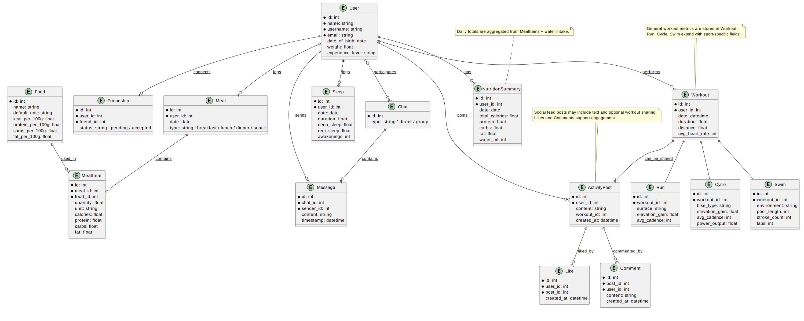

## Upfront Design

### Link to the full prototype

https://www.figma.com/proto/f6jB5vUjyB7yVAW8cT7QDW/Strava-1?node-id=16-252&p=f&t=vMX2EYy61Wszxy3y-1&scaling=scale-down&content-scaling=fixed&page-id=2%3A2&starting-point-node-id=16%3A252

### Get started page

This is the page the users will see when starting the app for the first time.
They will be greeted by our friendly mascot!

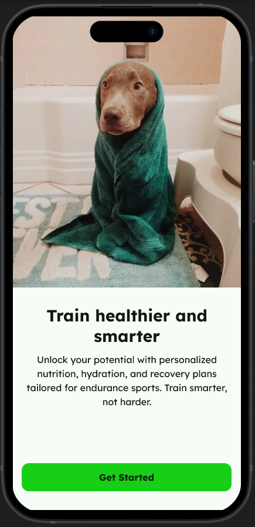

### Login page

A simple form where users enter their email and password to access the app, with
options for password reset, sign-up, or logging in with Google or Apple.

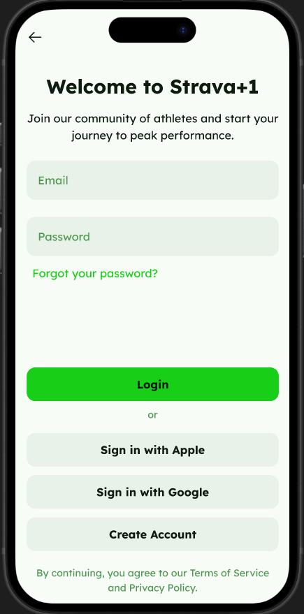

### Create-account

A registration form where users enter their name, email/username, and password
to create an account. Submitting the form creates the account and logs them in
automatically.

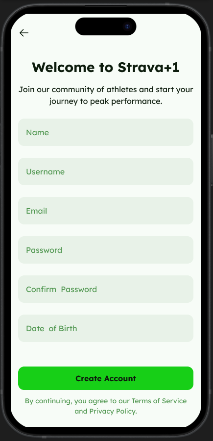

### Dashboard

The main home screen that highlights the user’s daily focus workout and shows a
quick summary of distance, duration, and calories burned. Navigation at the
bottom provides access to workouts, nutrition, recovery, and profile sections.
Buttons on the top take you to the app settings and your chats. You can also
scroll down for more information or tips on healthy exercise and nutrition as
seen in the [dashboard.webm](./wireframes/dashboard.webm) video.

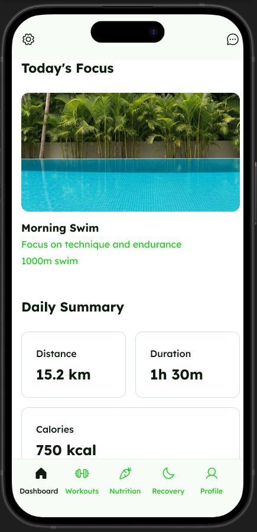

### Profile - Activities

Displays the user’s profile picture, name, location, and friend count, with tabs
for activity, about, and friends. The activity tab shows recent workouts along
with likes and comments, while the bottom navigation provides quick access to
other app sections.

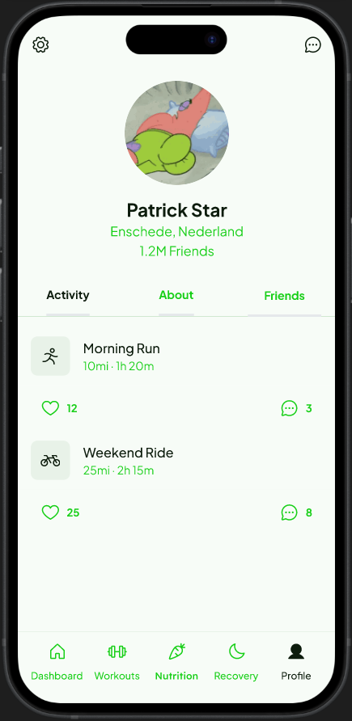

### Profile - Friends

Lets users search for new friends, manage pending friend requests with
accept/decline buttons, and view their current friends list, all within the
profile section.

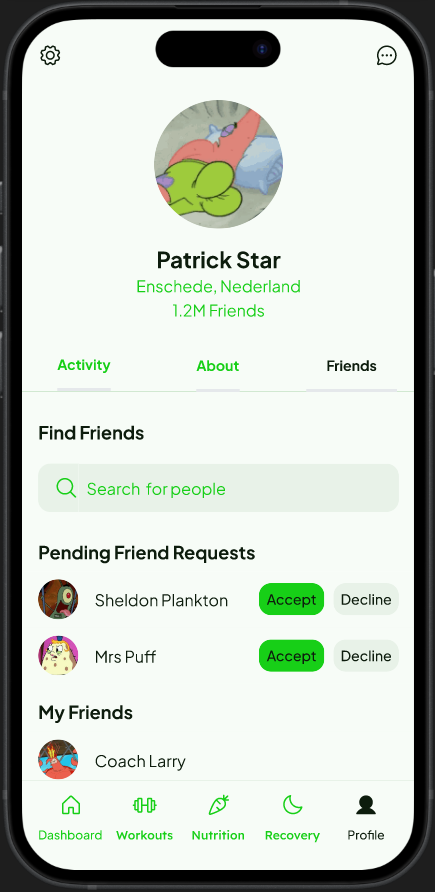

### Profile - About

Shows the user’s bio and interests, with an edit option for updating personal
details and fitness focus areas.

### All chats

Displays a list of recent conversations with friends, coaches, or groups. Each
chat entry shows the contact’s profile picture, name, and a preview of the most
recent message. A plus icon in the top-right corner lets users start a new chat.
The bottom navigation allows access to the dashboard, workouts, nutrition,
recovery, and profile sections.

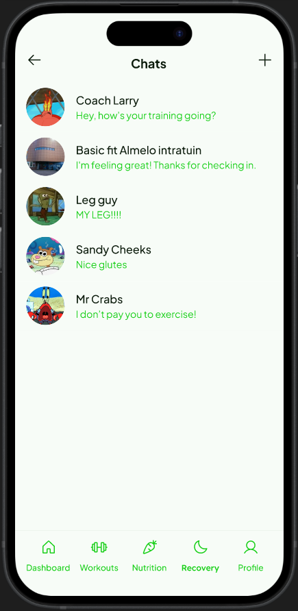

### New chat

Lets users start a new one-on-one or group conversation by selecting contacts
from a searchable list. Each contact is shown with a profile picture, name, and
role (e.g., coach, runner, nutritionist). Users can select one or more contacts
and tap the "Create (Group) Chat" button to begin messaging.

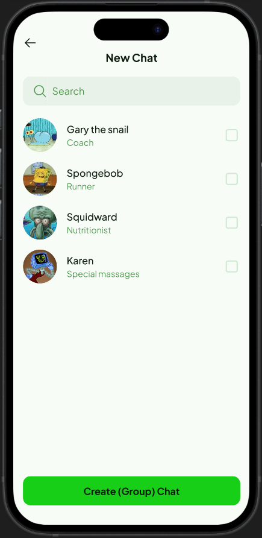

### Chat

Shows a real-time conversation between the user and a selected contact. Messages
are displayed in a chat bubble format with timestamps and profile icons for
clarity. Users can type messages in the text field at the bottom. The screen
also includes options for sending emojis, attachments or voice recordings.
Clicking top right will lead to the other persons profile page.

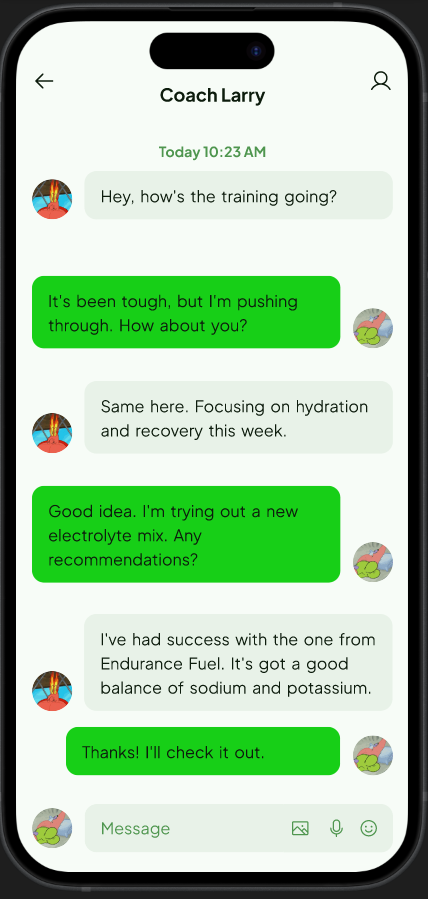

### Group Chat

Lets members exchange messages in real time within the group. Users can type
messages, add emojis, or attach media. Tapping the top-right icon opens the
group details page to view or manage members.

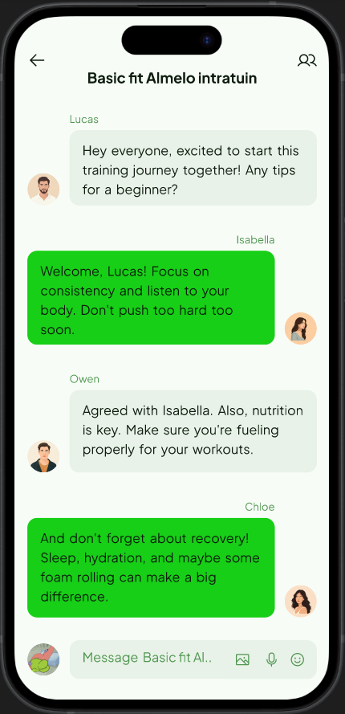

### Group details

Displays the group name and a list of members, showing roles like admin or
member. Users can add new members if permitted or leave the group with a single
tap.

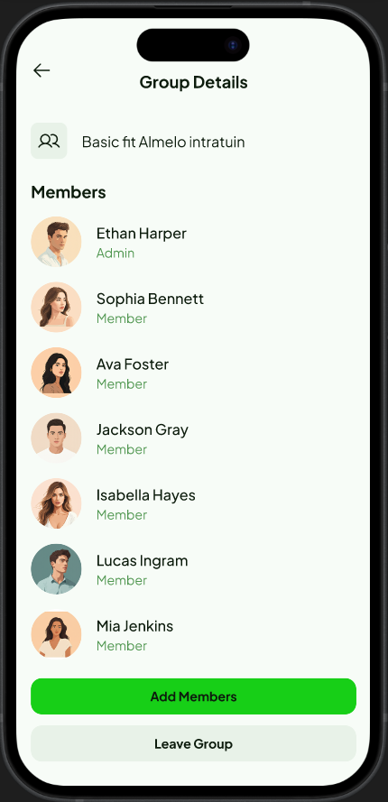

### Add group members

Lets users search and select friends to add to a group. A checkbox appears next
to each name, and tapping Add members confirms the selection and updates the
group.

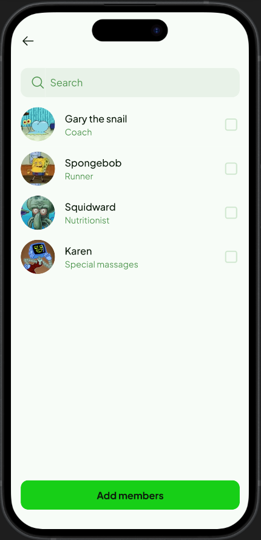

### Friend profile

Shows another user’s profile with options to Un/Befriend or Send Message. Tabs
let you view their Activity, About, and Friends list. This helps users connect
and explore social circles.

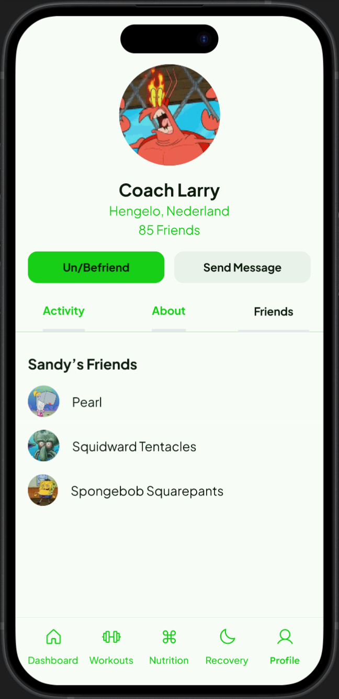

### Settings

Lets users customize their experience with options for notifications (push,
email), privacy (privacy settings, data sharing), integrations (connect devices,
linked apps), and general preferences (units, theme, language).

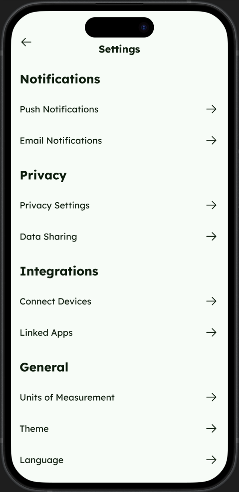

### Workouts

Displays a list of recent workouts (run, bike, swim) with distance and duration.
Users can sort or filter activities and use the plus button to add a new
workout.

### Workout

Displays detailed information for an ongoing workout. Includes a map of the
route, real-time alerts like Snack and Hydration reminders, and workout metrics
such as pace, distance, and duration. Users can monitor performance and tap
Finish to end the session. You can also scroll down for more information as seen
in the [workout.webm](./wireframes/workout.webm) video.

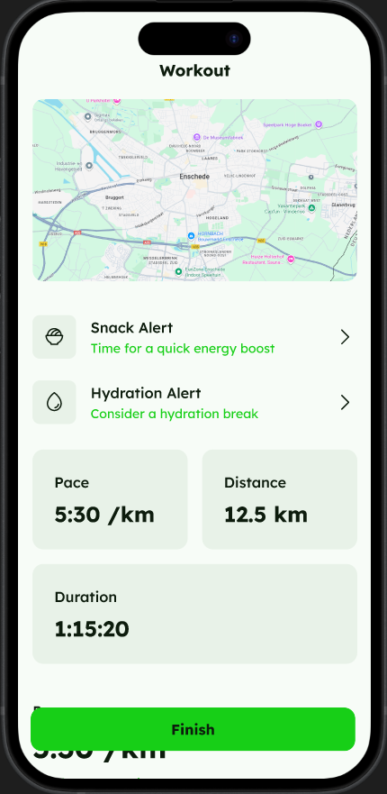

### Workout summary

Shows a detailed breakdown of a completed workout including distance, pace,
duration, and elevation gain. Includes a visual map of the route and a section
for performance analysis like pace trends over time. Helps users review and
reflect on their activity. Below is some personalized advice on nutrition and
recovery as seen in the
[workout-summary.webm](./wireframes/workout-summary.webm) video.

### Recovery

Shows sleep analysis from last night, including total sleep duration, deep
sleep, REM sleep, and a recovery score. A graph of sleep stages provides more
detail. Percentage changes from the previous night are displayed in green
(improvement) or red (decline). A History button lets users view past recovery
trends.

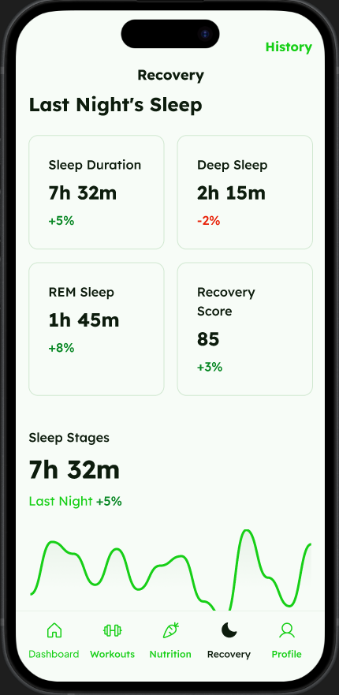

### Recovery History

Displays a list of past nights’ sleep data, showing date, total sleep duration,
and recovery score. Users can scroll through previous entries to track progress
and compare sleep quality across days.

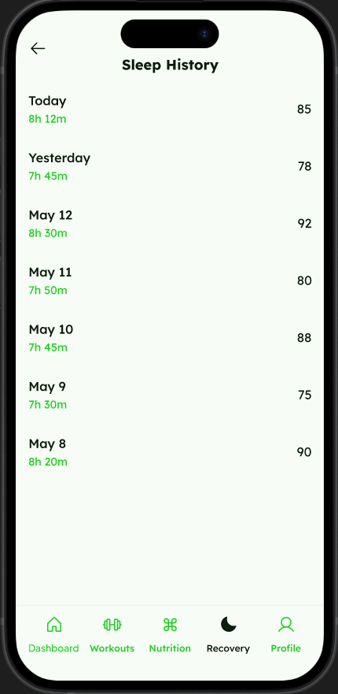

### Recovery Day

Provides a detailed breakdown of a specific night’s sleep, including total
sleep, quality score, and wake-ups. Visual bars show time spent in different
sleep stages (Awake, REM, Light, Deep). An Insights section offers personalized
feedback to help improve or maintain sleep quality.

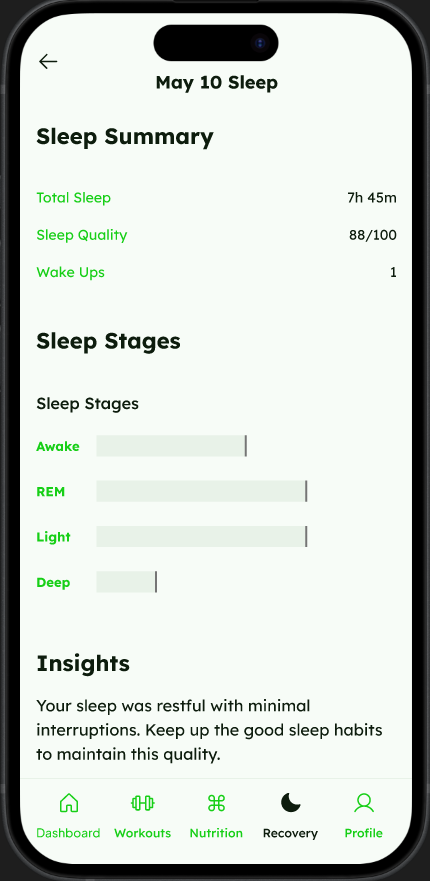

### Nutrition

Shows today's intake summary (calories, protein, carbs, fat), water progress
with a "Log Water" button, logged meals with calories and protein per meal, a
History button in the header, and micronutrient progress indicators (Vitamin D,
Iron, Calcium, Magnesium). Tapping meals opens details/edit, Log Water
increments water, and History navigates to past nutrition records. Full page can
be seen in [nutrition.webm](./wireframes/nutrition.webm) video.

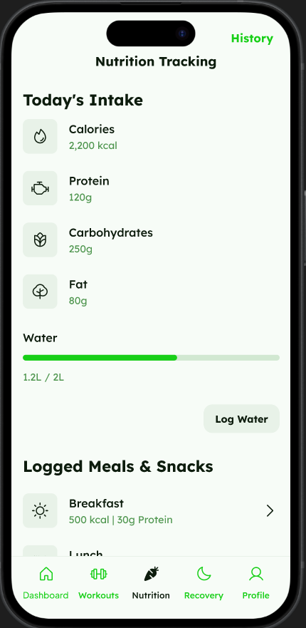

### Nutrition history

A history screen showing macronutrient balance and micronutrient intake overview
(status + last-30-days change) with small weekly trend charts, followed by a
scrollable list of past daily summaries (date plus calories and protein).
Tapping any daily entry opens that day’s full nutrition summary (meals, macros,
and micronutrient breakdown).

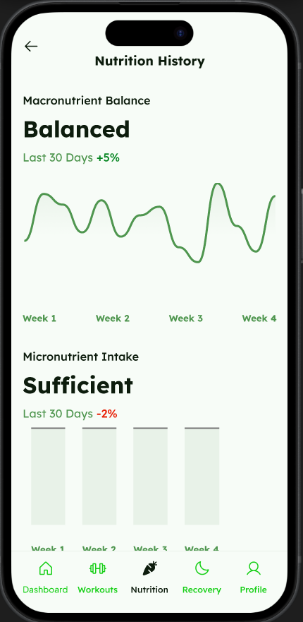

### Nutrition tab

This page shows the details of a selected meal (here, Breakfast), listing logged
food items with their calories, a nutrient summary of total calories, protein,
carbs, and fat, and an option to add more items. Navigation to other sections is
available at the bottom.

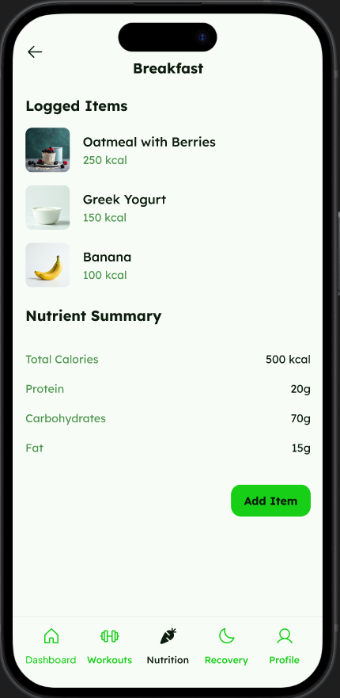

### Food quantity

This page lets the user specify how much of a selected food (e.g., Apple) they
are adding. They can choose units like grams, cups, or servings, and see the
corresponding nutrient values (calories, protein, carbs, fat) update. A button
at the bottom allows adding the chosen quantity to the meal.

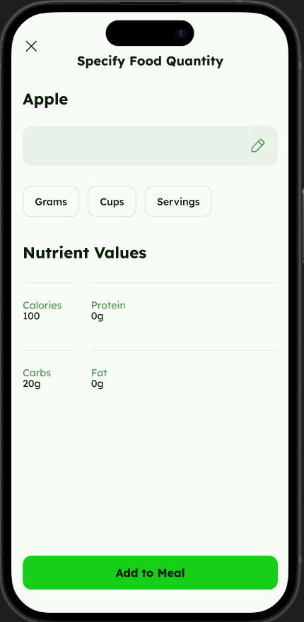

## User testing

### Purpose

This user testing session aims to evaluate the usability and intuitiveness of
the Strava+1 app. The app includes features like endurance workouts, sleep and
nutrition tracking, and social interaction tools such as chats and friend lists.

We’ve designed a set of wireframes for this app, and now we want to validate our
assumptions by observing how real users interact with the prototype.

This is done using the Thinking Aloud Protocol, where users complete tasks while
verbalizing their thoughts. This helps us identify pain points,
misunderstandings, or friction in the design.

Our goal is to uncover usability issues early in the design process, so we can
refine our interface before investing further in development.

### Research objectives

- Evaluate onboarding flow: Can users easily create an account and start a
  workout?
- Assess social features: Are users able to find and use group chat and friend
  management functions?
- Understand data navigation: Can users find specific data (e.g., sleep or
  nutrition logs) without guidance?
- Assess overall clarity: Is the interface easy to understand, or do users
  struggle to interpret icons, labels, or navigation paths?

### Target Users

A typical Strava+1 user:

- Exercises regularly (e.g., running, cycling, swimming)
- Is interested in tracking metrics like sleep and nutrition
- Wants to share and discuss progress with friends
- Has used apps like Strava, Nike Run Club, Fitbit, or MyFitnessPal before

### User Tasks

For this test, I recruited two friends to simulate the typical user experience.
Below are the five user tasks designed for this test. Each task includes a short
scenario for context and a clear goal.

### Test 1: First Experience with Strava+1

Scenario: You’ve heard of this new app, Strava+1, and decided to try it for your
next running workout. You download it, open it, and want to use it for your next
running session.

Objective: Create an account, finish a run workout, and view the results.

### Test 2: Chat with friends

Scenario: You’ve heard your friends also installed and started using Strava+1.
To make training more fun, you propose creating a group chat where you and your
closest friends can share all the wild adventures, achievements, and stories
from your workouts.

Objective: Create a group chat with your friends.

### Test 3: Delete a friend

Scenario: You’ve just discovered some dirty secrets about your friend Larry the
Lobster. After thinking it over, you decide you no longer want to stay connected
with him on Strava+1. You open the app and look for a way to remove Larry from
your friends list.

Objective: Unfriend Larry the Lobster.

### Test 4: Share sleep data

Scenario: Your friend keeps saying you missed the greatest party ever on May
10th. To prove your point, you want to show that your sleep was way more
important than any party. You open Strava+1 to check your sleep data for that
night and plan to send a screenshot to your friend as evidence.

Objective: View your sleep data on May 10th.

### Test 5: Update Nutrition List

Scenario: You suddenly remember that you forgot to log the apple you ate this
morning. You don’t want your nutrition tracking to be incomplete, so you quickly
add it to your nutrition list before you forget again.

Objective: Add the missing apple to your breakfast nutrition list.

### Results

The usability tests were largely successful. Both participants, Pepijn and Eran,
were able to complete all assigned tasks and provided valuable feedback for
potential improvements. Pepijn managed to complete all tests without any issues.
His main suggestion was to display the date alongside completed workouts to make
it easier for users to see when each activity took place. This feedback is both
reasonable and aligns with typical user expectations for workout tracking
applications.

Eran also completed the tests successfully, though he experienced some confusion
during the second test involving the creation of a group chat. Initially, he
navigated to the friends page instead of the chats overview, indicating that the
chat creation option might not be immediately intuitive. He mentioned that it
would have been nice if, from the friends page, users could already select and
hold a friend to start creating a group chat. Additionally, when inside a
specific chat, it would be useful to have a three-dotted menu button offering
options such as unfriending, reporting, or adding new members to expand the
chat.

In his own words, Eran also noted that it would be helpful if sleep history
could be accessed by scrolling down or swiping, instead of tapping a separate
button. He found the overall layout and style clear and visually appealing but
suggested that small usability improvements, such as more intuitive group
creation and gesture-based navigation, could enhance the experience further.

While these are minor suggestions, they highlight useful directions for future
iterations of the app. Most notably, improving accessibility for chat-related
actions and enhancing navigation between related pages, like sleep and chat
interfaces, could lead to a smoother and more intuitive user experience.

### Recordings

All screen + audio recordings are included in the user-tests-recordings folder.
Please refer to:

- pepijn.mkv
- eran.mp4

## Help Received

Pepijn and Eran assisted with user testing the functional design, providing
valuable feedback that helped refine the design.

For the wireframes, I reached out to Roy, who had already done his project. He
shared that he had used Google Stitch in combination with Figma and highly
recommended it. I'm really glad I followed his advice, as Stitch made it
incredibly easy to generate a solid design and export it directly to Figma. This
saved me a lot of time and effort in the process!
