## Introduction

Endurance athletes often struggle to maintain proper hydration and nutrition
during long workouts. Drinking too little can lead to dehydration and reduced
performance, while drinking too much can cause discomfort or even hyponatremia
(low blood sodium). Similarly, consuming too few or too many carbohydrates can
negatively affect energy levels and overall performance.

To support athletes during training, there is a need for a system that can
simulate internal hydration and carbohydrate levels and react to eating and
drinking events in real time. The challenge is to use data such as heart rate,
speed, temperature, and the athlete’s pre-workout intake to generate
personalized, adaptive recommendations for how much to drink and how many
carbohydrates to consume throughout the workout. These recommendations must
adjust to changes in workout intensity, environmental conditions, and the
athlete’s actual in-workout eating and drinking behaviour. This makes the
problem non-trivial and an important research and development challenge for the
Strava+1 platform.

## Definition of Success

Success for this part of the project means delivering, within 3 weeks, a working
prototype that provides real-time, personalized hydration and nutrition advice
during an endurance workout. The system should combine live workout data, heart
rate, speed, and temperature, with the athlete’s pre-workout intake and track
estimated hydration and carbohydrate levels over time. It should update these
estimates whenever the athlete eats or drinks during the workout. The system
should simulate the workout state and react to intake events provided by the
user. As part of this, the system must recommend specific amounts of fluid (in
millilitres) and carbohydrates (in grams) that the athlete should consume at
each update.

A successful prototype will:

- Respond in real time, calculating and delivering hydration and nutrition
  advice within 1 second of receiving new data.
- Continuously track estimated fluid and carbohydrate levels throughout the
  workout, keeping estimates reasonable based on observed trends.
- The system should update at least once per minute and provide actionable
  advice specifying how many grams of carbohydrates and how many milliliters of
  fluid the athlete should consume. It should automatically adapt
  recommendations based on changing workout conditions and the athlete’s
  personal data, including heart rate, speed, temperature, pre-workout intake,
  and real-time consumption.
- Stay aligned with the science-informed hydration and fueling limits defined
  for this prototype, which are derived from established sports-nutrition
  research (see prototype – Hydration & Fueling Limits), in order to produce
  safe, physiologically realistic recommendations and avoid advising potentially
  harmful over-hydration or over-fueling.

In short, the prototype is successful if, within 3 weeks of development, it can
deliver safe, continuously updated hydration and nutrition recommendations
throughout the workout, based on live data and estimated internal levels, in a
way that is timely, and adaptive.

## References to Resources Consulted

My goal was to explore how an endurance athlete’s internal hydration and energy
state can be estimated and managed during a workout. To support this, I reviewed
sports-nutrition and exercise-physiology research on sweat loss, hydration,
fueling, and performance limits, and used these insights to design a set of
simple, realistic, and safe rules for a prototype system that generates adaptive
hydration and nutrition advice.

Here are the main resources I used:

1. Armstrong et al. (2021) – Rehydration during Endurance Exercise
   [Link](https://pmc.ncbi.nlm.nih.gov/articles/PMC8001428)

This paper explained how dehydration affects performance and how much people
should drink during long workouts. It also mentioned that drinks with carbs and
electrolytes can help keep energy levels up.

2. Francisco et al. (2025) – Does Hypohydration Really Impair Endurance
   Performance?
   [Link](https://link.springer.com/article/10.1007/s40279-025-02310-6)

Confirmed that performance usually drops once you lose around 2% of your body
weight from sweat, which gave me a good limit to use in my prototype.

3. Jeukendrup, A. E. (2014) – A step towards personalized sports nutrition:
   Carbohydrate intake during exercise
   [Link](https://pmc.ncbi.nlm.nih.gov/articles/PMC4008807/)

This was useful because it explains the limits of carbohydrate absorption during
exercise, showing that most athletes can only oxidize around 60 g of
carbohydrates per hour unless using multiple transportable carbs. This supports
placing an upper cap on single carbohydrate intake events to avoid GI overload.

4. Tiller, N. B., et al. (2019) – International Society of Sports Nutrition
   Position Stand: Nutritional considerations for single-stage ultra-marathon
   training and racing
   [Link](https://www.researchgate.net/publication/337089679_International_Society_of_Sports_Nutrition_Position_Stand_Nutritional_considerations_for_single-stage_ultra-marathon_training_and_racing)

This was useful because it emphasizes the importance of moderate, frequent fluid
intake, recommending ~450–750 mL/h, noting that large single boluses exceed
gastric emptying capacity and increase GI distress risk. This supports setting a
cap on maximum fluid intake per event.

5. Costa, R. J. S., et al. (2023) – The Effect of Gut-Training and
   Feeding-Challenge on Markers of Gastrointestinal Status in Response to
   Endurance Exercise
   [Link](https://link.springer.com/article/10.1007/s40279-023-01841-0)

This was useful because it shows that frequent, repeated carbohydrate intake
during exercise improves gastrointestinal tolerance, reduces discomfort, and
enhances absorption capacity. The study demonstrates that

6. Sawka, M. N., et al. (2000) – Fluid and electrolyte supplementation for
   exercise heat stress
   [Link](https://ajcn.nutrition.org/article/S0002-9165%2823%2906737-0/fulltext)

This was useful because it explains that during exercise in hot conditions,
sweat output often exceeds water intake, leading to greater fluid loss and a
higher risk of dehydration. The increased need for sweat-based thermoregulation
in higher temperatures implies that athletes must increase fluid intake
accordingly to maintain hydration and performance.

7. Holmes, N., Bates, G., Zhao, Y., Sherriff, J., & Miller, V. (2016) – The
   Effect of Exercise Intensity on Sweat Rate and Sweat Sodium and Potassium
   Losses in Trained Endurance Athletes
   [Link](https://www.jscimedcentral.com/jounal-article-info/Annals-of-Sports-Medicine-and-Research/The-Effect-of-Exercise-Intensity-on-Sweat-Rate-and-Sweat-Sodium-and-Potassium-Losses-in-Trained-Endurance-Athletes-4290)

This was useful because it found a significant positive relationship between
exercise intensity and sweat rate in trained endurance athletes. With increasing
intensity (e.g., higher heart rate), sweat losses and electrolyte losses
increased, implying greater fluid requirements. These results support the idea
that higher exertion should trigger increased fluid recommendations in the
prototype.

8. Berry, C. W., et al. (2021) – Hydration and carbohydrate considerations
   during high-intensity exercise in the heat
   [Link](https://www.frontiersin.org/journals/sports-and-active-living/articles/10.3389/fspor.2021.742710/full)

The paper shows that high-intensity exercise in hot conditions (≈35–40 °C)
produces a strong sweating response, leading to significant fluid loss and
increased cardiovascular strain. It also notes that dehydration of ≥2% body mass
impairs performance. These findings support increasing fluid recommendations
when temperatures are high and exercise intensity is elevated.

9. Jeukendrup, A. (2014) – Carbohydrate Intake During Exercise. PMC article via
   NIH/PMC: [Link](https://pmc.ncbi.nlm.nih.gov/articles/PMC4008807/)

This was useful because it highlights that carbohydrate oxidation and intestinal
absorption have physiological limits. Consuming carbohydrates beyond these
limits provides no additional performance benefit and increases the risk of
gastrointestinal distress. The review also discusses coordinating fluid,
carbohydrate, and electrolyte intake during exercise without exceeding what can
be tolerated physiologically, supporting the need for upper intake limits.

10. Godek et al. (2008) – Normative data for sweating rate, sweat sodium
    concentration, and sweat sodium loss in athletes: An update and analysis by
    sport.
    [Link](https://www.gssiweb.org/research/article/normative-data-for-sweating-rate-sweat-sodium-concentration-and-sweat-sodium-loss-in-athletes-an-update-and-analysis-by-sport)

Although focused on team sports, this paper gave reference values for realistic
sweat ranges.

11. Urdampilleta et al. (2020) – Effects of 120 vs. 60 and 90 g/h carbohydrate
    intake during a trail marathon.
    [Link](https://www.mdpi.com/2072-6643/12/7/2094)

This study shows that a high carbohydrate intake (120 g per hour) during a
long‑duration mountain race can reduce neuromuscular fatigue and improve
recovery of high‑intensity running capacity.

12. Cleveland Clinic (n.d.) – Water intoxication (hyponatremia).
    [Link](https://my.clevelandclinic.org/health/diseases/water-intoxication)

This clinical overview explains that water intoxication can occur when fluid
intake exceeds the body’s ability to excrete water (typically around 0.8–1 L per
hour), leading to dangerous dilution of blood sodium levels. It highlights that
risk increases with rapid, excessive intake over a short period. In the context
of exercise, a moderate increase in fluid intake is justifiable due to sweat
loss and elevated physiological demand, but intake must still remain within safe
limits to avoid hyponatremia.

## Alternative Ways to Approach the Problem

There are multiple ways to design a system that estimates an athlete’s internal
fluid and carbohydrate levels during a workout and updates recommendations
whenever the athlete eats or drinks.

A simple option is a purely rule-based system that follows general guidelines,
for example recommending fixed amounts like 150–250 ml of water every 20 minutes
or 30–60 g of carbohydrates per hour. This is easy to implement but does not
adapt to individual athletes, changing workout intensity, or actual intake
during the session.

A more adaptive approach is a personalised rule-based model that uses
science-based hydration and fueling guidelines together with live sensor data
such as heart rate, speed, temperature, and estimated sweat and carbohydrate
use. The system updates its estimates continuously as the athlete eats, drinks,
or changes effort, providing guidance that is realistic and responsive while
still lightweight enough for real-time use.

Machine learning methods could also be used to predict hydration and fueling
needs based on patterns in historical data. While such approaches may offer
higher accuracy, they require large datasets, significant computational
resources, and extensive scientific instrumentation, making them less suitable
for a real-time prototype developed within a limited three-week timeframe.

Another alternative is a fully physiological simulation that mathematically
models sweat loss, glycogen depletion, and nutrient absorption. While such
models can be highly accurate, they rely on detailed physiological inputs that
are difficult or impossible to measure during normal workouts and require
substantial development and validation effort, making them impractical to
implement within a three-week prototype timeframe.

## Motivated Decision

For the prototype, I implemented a personalized, adaptive system that estimates
the athlete’s internal fluid and carbohydrate levels during a workout. The
system is built around scientifically grounded baselines for hydration and
fueling, then continuously updates in real time as the athlete exercises, eats,
or drinks. It ensures recommendations are safe, realistic, and tailored to the
athlete’s actual conditions, accounting for effort, environmental factors, and
intake.

This approach supports the project goal of providing personalized, real-time
hydration and nutrition guidance while remaining feasible for a lightweight,
real-time prototype.

## Prototype

### Individual Variability

Before explaining how the model works, it’s important to mention a big
limitation: **every athlete is different**. People don’t sweat the same amount,
even if they run the same speed, in the same temperature, and have the same body
weight. Some athletes barely sweat, while others could fill buckets. The same
thing applies to carbohydrates: some athletes burn through carbs very fast,
while others rely more on fat and burn carbs slower.

Things that influence these differences include:

- fitness level
- genetics
- body size
- heat acclimation
- clothing
- hydration status before starting
- training intensity
- even stress or caffeine intake

Because of this, no simple model can give perfectly accurate numbers for every
person. So the model in this prototype should be seen as a **rough estimate**,
not a medical tool. It gives the user an idea of what might be happening, but
real-world values may be higher or lower depending on the individual.

The goal is not to be perfectly precise for every possible athlete and
condition, but to give estimates that are reasonable. The model is calibrated so
that an athlete working at a typical endurance intensity produces values roughly
in line with published reference studies.

**Note**: The coefficients used in these models (e.g., the baseline sweat rate,
heart-rate multipliers, temperature factors, and the carb-burn scaling values)
were not selected to represent exact physiology, but rather calibrated so that a
typical endurance athlete exercising at moderate intensity produces estimates
that fall within ranges commonly reported in the scientific literature.

### Defining Inputs

Before building the model, it’s important to define exactly what data the system
receives during a workout. Each incoming sample includes real-time sensor
measurements, user-specific static information, and pre-workout nutrition, which
allows the system to estimate carbohydrate and hydration status more accurately.

| Category                      | Field            | Type    | Unit / Format | Description                                          |
| ----------------------------- | ---------------- | ------- | ------------- | ---------------------------------------------------- |
| **Real-time Data (measured)** | `heart_rate`     | integer | bpm           | Athlete’s instantaneous heart rate                   |
|                               | `speed`          | float   | km/h          | Athlete’s current movement speed                     |
|                               | `ambient_temp_c` | float   | °C            | Ambient temperature at the time of measurement       |
| **User Profile (static)**     | `weight_kg`      | float   | kg            | Athlete’s body weight                                |
|                               | `pre_carb_g`     | float   | g             | Estimated carbohydrate intake from pre-workout meals |
|                               | `pre_fluid_ml`   | float   | ml            | Estimated fluid intake from pre-workout meals        |

### Hydration & Fueling Limits (Safety Constraints)

These rules define the hard safety boundaries used by the prototype to ensure
hydration and fueling recommendations remain physiologically realistic and well
tolerated during endurance exercise. They are not intended as performance
targets, but as conservative limits derived from sports-nutrition research to
prevent unrealistic, unsafe, or gastrointestinally stressful recommendations
within the simulated system.

| **Rule Type**              | **Scientific Guideline**                             | **Prototype Rule / System Behavior**                                                                                                                                                      | **Rationale (Why the System Does This)**                                                                                                                                                                                                    | **Refs**        |
| -------------------------- | ---------------------------------------------------- | ----------------------------------------------------------------------------------------------------------------------------------------------------------------------------------------- | ------------------------------------------------------------------------------------------------------------------------------------------------------------------------------------------------------------------------------------------- | --------------- |
| **Hydration threshold**    | Dehydration > ~2% body weight reduces performance    | System aims to keep recommended fluid intake above 2%                                                                                                                                     | Prevents performance decline and maintains physiological function                                                                                                                                                                           | [1], [2], [8]   |
| **Max mealing limit**      | Very large single intakes reduce gut tolerance       | For this prototype, never exceed 750 ml fluid or 60 g carbohydrates in a single intake                                                                                                    | Avoids exceeding gastric emptying and carb absorption limits; reduces GI distress from overly large boluses                                                                                                                                 | [3], [4]        |
| **Small frequent fueling** | Frequent small feedings improve gut comfort & uptake | For this prototype, the system recommends eating or drinking again once the previous intake is estimated to be absorbed                                                                   | Supports better absorption, steady energy delivery, and reduced GI distress by following evidence that smaller, more frequent feedings are better tolerated during endurance exercise                                                       | [5]             |
| **Absorption window**      | Hourly absorption capacity limits                    | For this prototype, the system tracks absorbed intake over a rolling 60-minute window and prevents recommendations that would exceed 1,500 ml of fluid or 120 g of carbohydrates per hour | Hourly intake recommendations in sports nutrition are constrained by physiological absorption and tolerance limits. The prototype applies conservative upper safety ceilings to ensure realistic and safe behavior in the simulated system. | [9], [11], [12] |

### Hydration & Fueling Adjustments

These rules apply small, proportional adjustments to hydration and fueling
recommendations based on changing workout conditions such as temperature and
exercise intensity. They are intended to improve the realism of the prototype’s
recommendations by accounting for known trends in sweat loss and physiological
strain.

| **Rule Type**                | **Scientific Guideline**                                                                     | **Prototype Rule / System Behavior**                                                                                                                            | **Rationale (Why the System Does This)**                                                                                                                                                                                                                                                            | **Refs** |
| ---------------------------- | -------------------------------------------------------------------------------------------- | --------------------------------------------------------------------------------------------------------------------------------------------------------------- | --------------------------------------------------------------------------------------------------------------------------------------------------------------------------------------------------------------------------------------------------------------------------------------------------- | -------- |
| **Temperature adjustment**   | Higher temperatures increase sweat loss                                                      | For this prototype, when temperature rises by +5 °C above 20 °C, the system will increase fluid recommendations by +10%                                         | Research shows that exercising in hot conditions causes greater sweat losses and increases the risk of dehydration. To account for this, the prototype applies a simple proportional adjustment to fluid needs.                                                                                     | [6]      |
| **Intensity adjustment**     | Higher exercise intensity increases sweat rate                                               | For this prototype, when HR exceeds 160 bpm or speed exceeds 15 km/h, the system will increase fluid recommendations by +15%                                    | Research shows that higher exercise intensity leads to significantly greater sweat losses, meaning athletes require more fluid to maintain hydration. The prototype applies a simple increase to account for this.                                                                                  | [7]      |
| **Heat + high effort combo** | Combined environmental heat and high exertion increase physiological strain and sweat losses | For this prototype, when temperature exceeds 30 °C and heart rate exceeds 85% of max, the system will increase fluid and carbohydrate recommendations by 10–15% | Research shows that high-intensity exercise in hot conditions significantly elevates sweat rates and cardiovascular strain, supporting increased fluid needs. The prototype also applies a proportional increase in carbohydrate intake as a design choice to account for higher metabolic demands. | [8]      |

### Implementation

All code can be found in [feed.py](./feed.py).

### Athlete State

The AthleteState class keeps track of the athlete’s key internal values during a
workout. It stores current fluid and carbohydrate levels, totals, what the
athlete has eaten or drunk, and the system’s current advice. Cooldowns prevent
repeated advice too quickly, and absorption history helps simulate how the body
processes fluids and carbs over time.

```python
class AthleteState:
    def __init__(self, weight_kg, pre_fluid_ml, pre_carbs_g):
        self.weight_kg = weight_kg

        # Dynamic internal estimates
        self.fluid_level_ml = pre_fluid_ml
        self.carb_level_g = pre_carbs_g

        # Totals (for charts, debugging, recommendations)
        self.total_fluid_loss = 0
        self.total_carb_use = 0

        # Advice on how much the athlete should drink or eat
        self.current_advice = {
            "drink_ml": 0,
            "eat_g": 0
        }

        # History for when the user drank or ate
        self.stomach_ml = 0
        self.absorbed_history = []
        self.hourly_absorbed_ml = 0

        self.stomach_carbs_g = 0
        self.carb_absorbed_history = []
        self.hourly_absorbed_carbs_g = 0
        self.carb_cooldown_remaining = 0

        # Cooldowns for eating/drinking
        self.hydration_cooldown_remaining = 0
```

### Workout Data

The WorkoutData class represents a single snapshot of sensor inputs during a
workout. It stores heart rate, speed, and temperature, and optionally what the
athlete has just drunk or eaten. Each instance is used by the engine to update
the athlete’s state and generate advice.

```python
class WorkoutData:
    """
    A single point/tick of sensor inputs.
    """
    def __init__(self, heart_rate, speed, temperature, drink_ml=None, eat_g=None):
        self.heart_rate = heart_rate
        self.speed = speed
        self.temperature = temperature
        self.drink_ml = drink_ml
        self.eat_g = eat_g
```

#### Sweat-Loss Estimation Model

I use a simple sweat-loss model that reacts to effort and temperature instead of
trying to simulate full human physiology. Research shows that sweat rates vary
widely between athletes, with average values around 1.28 ± 0.57 L/h [10], but
real rates can range from about 0.5 L/h to over 2 L/h. Because sweat loss cannot
be predicted accurately using only heart rate and temperature, the model uses a
lightweight “best-guess” approach based on measurable signals: a baseline sweat
rate, increased loss with higher heart rate, additional loss in hotter
conditions, and slightly higher rates for heavier athletes. This reflects common
sports-science patterns and produces realistic minute-to-minute behavior without
requiring laboratory measurements.

```python
# Sweat loss model (ml/min)
def estimate_sweat_loss(self, hr, temp):
    base_sweat = 6  # ml/min low-end baseline (0.36 L/h)

    hr_factor = max(0, hr - 120) * 0.5
    temp_factor = max(0, temp - 15) * 1.2
    weight_factor = (self.state.weight_kg - 70) * 0.2

    return base_sweat + hr_factor + temp_factor + weight_factor
```

#### Carbohydrate-Burn Estimation Model

I created a simple carb-burn model that reacts to heart rate, speed, and body
weight. Actual carbohydrate use varies widely between athletes depending on
fitness, VO₂ max, and fuel mix, so this model is not intended to be
physiologically exact, but rather a rough estimate that behaves realistically
during a workout.

Research shows that carbohydrate oxidation increases with exercise intensity,
with reported peak oxidation rates around 1.26 g/min [9]. Although carbohydrate
oxidation and total carbohydrate burn are not the same physiological process,
this model treats them as equivalent for simplicity, using reported oxidation
rates as a practical reference to keep estimated carb burn within realistic
endurance-exercise ranges.

In practice, higher heart rate and faster speed increase the estimated carb
burn, while heavier body weight adds a small additional effect, allowing the
system to respond believably to changes in effort without attempting to model
full metabolic physiology.

```python
# Simple carb burn model (g/min)
def estimate_carb_burn(self, hr, speed):
    carb_from_hr = max(0, hr - 120) * 0.03
    speed_factor = speed / 10
    weight_factor = self.state.weight_kg / 70.0

    return carb_from_hr * speed_factor * weight_factor
```

#### Calculate recommended fluid intake

The hydration-advice function gives a simple, safe drinking recommendation based
on the athlete’s current fluid level, sweat loss, and workout conditions. It
first checks safety rules: never go above the 1,500 ml/hour absorption limit,
and don’t recommend drinking if the athlete already drank. Then it looks at how
low the “tank” is and how much total fluid has been lost, increasing the advice
if levels are dropping. It also applies a small baseline amount to prevent slow
dehydration. Heat and high intensity raise the recommendation, while a cooldown
lowers it. Finally, it caps the amount so it stays realistic and safe (max
750ml). Overall, it gives a quick minute-by-minute suggestion that reacts to
effort, temperature, and hydration status without breaking any safety limits.

```python
def calculate_hydration_advice(self, sweat_loss, hr, speed, temp):
    if self.state.hourly_absorbed_ml >= 1500 or self.state.stomach_ml > 0:
        return 0

    if self.state.hydration_cooldown_remaining > 0:
        return 0

    current = self.state.fluid_level_ml
    total   = self.state.total_fluid_loss
    weight  = self.state.weight_kg

    optimal_level = 700
    ok_level      = 400
    low_level     = 200

    if current >= optimal_level:
        tank_zone = 0.0
    elif current <= low_level:
        tank_zone = 1.0
    else:
        tank_zone = (optimal_level - current) / (optimal_level - low_level)

    max_safe_loss = weight * 20
    loss_zone = min(1.0, total / max_safe_loss)

    base = sweat_loss
    extra = 150 * tank_zone + 300 * loss_zone
    recommendation = base + extra

    hourly_baseline = 0.02 * weight * 1000 # 2% hydration
    per_min_baseline = hourly_baseline / 60
    recommendation = max(recommendation, per_min_baseline)

    if temp > 20:
        temp_steps = (temp - 20) // 5
        recommendation *= 1 + (0.10 * temp_steps)

    if hr > 160 or speed > 15:
        recommendation *= 1.15

    est_max_hr = 200
    if temp > 30 and hr > 0.85 * est_max_hr:
        recommendation *= 1.15

    recommendation = min(750, recommendation)
    remaining_hourly_capacity = 1500 - self.state.hourly_absorbed_ml
    recommendation = min(recommendation, remaining_hourly_capacity)

    return max(0, recommendation)
```

#### Calculate recommended carbohydrate intake

The carbohydrate-advice function gives a simple, safe recommendation for how
many grams of carbs the athlete should take each minute. It first checks the
basic limits: don’t recommend anything if the athlete is in a cooldown period
and their carb tank isn’t too low, and never go past the 120 g/hour absorption
cap. It then looks at how “empty” the carb tank is and how much total energy has
been burned so far, adding more carbs if levels are dropping or the workout has
been going on for a long time. The advice also reacts to extreme heat and very
high heart rate by slightly increasing the recommendation. In the end, the value
is capped so it stays realistic (max 60g) and safe. Overall, it’s a lightweight
rule-based system that updates every minute and responds to fatigue, duration,
and intensity.

```python
def calculate_carb_advice(self, carb_loss, temperature, hr):
    # Do not advise carbs if cooling down AND last snack has not yet been absorped
    if self.state.carb_cooldown_remaining > 0 and self.state.stomach_carbs_g > 0:
        return 0

    # Hourly absorption cap
    if self.state.hourly_absorbed_carbs_g >= 120:
        return 0

    current = self.state.carb_level_g
    total   = self.state.total_carb_use
    weight  = self.state.weight_kg

    optimal = 60
    ok      = 30
    low     = 15

    # tank emptiness: 0 full → 1 empty
    if current >= optimal:
        tank_zone = 0.0
    elif current <= low:
        tank_zone = 1.0
    else:
        tank_zone = (optimal - current) / (optimal - low)

    # duration / total burn factor
    max_hourly = weight * 2
    burn_zone = min(1.0, total / max_hourly)

    extra = 20 * tank_zone + 40 * burn_zone

    recommendation = carb_loss + extra

    est_max_hr = 200
    if temperature > 30 and hr > 0.85 * est_max_hr:
        recommendation *= 1.15

    return min(60, max(0, recommendation))
```

#### Absorption Update

The update_absorption function simulates how fluids and carbohydrates are
absorbed from the stomach into the athlete’s internal state. It moves a fixed
amount from stomach_ml and stomach_carbs_g into fluid_level_ml and carb_level_g
each minute, tracks recent absorption for hourly estimates, and ensures the
totals stay within realistic physiological limits.

```python
def update_absorption(self):
    absorption_rate = 40  # ml/min

    absorbed = min(absorption_rate, self.state.stomach_ml)
    self.state.stomach_ml -= absorbed

    # Add to internal fluid level
    self.state.fluid_level_ml = min(1500, self.state.fluid_level_ml + absorbed)

    # Track hourly absorption window
    self.state.absorbed_history.append((self.current_tick, absorbed))

    cutoff = self.current_tick - 60
    self.state.absorbed_history = [
        (t, ml) for (t, ml) in self.state.absorbed_history if t > cutoff
    ]

    self.state.hourly_absorbed_ml = sum(ml for (_, ml) in self.state.absorbed_history)

    carb_absorption_rate = 1.5  # g/min typical for gels/chews

    absorbed_carbs = min(carb_absorption_rate, self.state.stomach_carbs_g)
    self.state.stomach_carbs_g -= absorbed_carbs

    # Add to internal carb level
    self.state.carb_level_g = min(200, self.state.carb_level_g + absorbed_carbs)

    # Track 60-minute absorption window (carbs)
    self.state.carb_absorbed_history.append((self.current_tick, absorbed_carbs))

    self.state.carb_absorbed_history = [
        (t, g) for (t, g) in self.state.carb_absorbed_history if t > cutoff
    ]

    self.state.hourly_absorbed_carbs_g = sum(g for (_, g) in self.state.carb_absorbed_history)
```

#### Main Update

The update function simulates one tick/minute of the workout. It estimates sweat
and carbohydrate losses based on heart rate, speed, and temperature, updates the
athlete’s internal fluid and carb levels, calculates hydration and carb advice
(how much to drink and eat), processes any intake from the athlete by adding it
to the stomach and setting absorption cooldowns, updates cumulative totals,
advances the simulation tick, and calls update_absorption() to move nutrients
from the stomach into internal stores. This ensures the athlete’s state is
continuously realistic and the advice remains current and actionable throughout
the workout.

```python
# One tick update
def update(self, workout_data):

    # 1. Compute losses
    sweat_loss = self.estimate_sweat_loss(
        workout_data.heart_rate,
        workout_data.temperature
    )
    carb_loss = self.estimate_carb_burn(
        workout_data.heart_rate,
        workout_data.speed
    )

    # 2. Update internal state
    self.state.fluid_level_ml = max(0, self.state.fluid_level_ml - sweat_loss)
    self.state.carb_level_g = max(0, self.state.carb_level_g - carb_loss)

    # 3. Calculate advice
    self.state.current_advice = {
        "drink_ml": self.calculate_hydration_advice(sweat_loss, workout_data.heart_rate, workout_data.speed, workout_data.temperature),
        "eat_g": self.calculate_carb_advice(carb_loss, workout_data.temperature, workout_data.heart_rate)
    }

    # 4. Update if the user ate or drank
    if workout_data.drink_ml:
        intake = workout_data.drink_ml
        self.state.stomach_ml += intake

        # Add scaled cooldown
        absorption_rate = 40  # ml/min
        self.state.hydration_cooldown_remaining += intake / absorption_rate
    if workout_data.eat_g:
        intake = workout_data.eat_g
        self.state.stomach_carbs_g += intake

        # Cooldown based on intake
        absorption_rate = 1.5
        self.state.carb_cooldown_remaining += intake / absorption_rate

    # Update cumulative loss over entire workout
    self.state.total_fluid_loss += sweat_loss
    self.state.total_carb_use += carb_loss

    # Advance simulation time and update cooldowns/absorption
    self.current_tick += 1
    self.state.hydration_cooldown_remaining = max(
        0,
        self.state.hydration_cooldown_remaining - 1
    )
    self.state.carb_cooldown_remaining = max(
        0,
        self.state.carb_cooldown_remaining - 1
    )
    self.update_absorption()
```

### Testing

In case of the Real-Time, Continuous tracking and Science limits tests, the
prototype is tested using a normal baseline athlete state:

```python
AthleteState(weight_kg=70, pre_fluid_ml=1000, pre_carbs_g=60)
```

This represents an average athlete who starts the workout well-hydrated and
properly fueled.

All workout data used in the tests is manually generated rather than taken from
real-world sessions. This makes it easier to test the system in a controlled and
repeatable way, because specific conditions, such as steadily increasing heart
rate, sudden intensity spikes, or unusually high temperatures, can be created on
purpose. By manually crafting the input values, the prototype can be tested
under both normal and extreme scenarios without depending on unpredictable
real-world recordings. This allows the behaviour of the system to be inspected
more clearly.

#### Real-Time Hydration & Nutrition Advice

##### Goal

Verify that the system can process a single new workout data point, including
updating the athlete’s state, calculating fluid and carbohydrate losses,
updating intake and absorption, and generating advice within 1 second.

##### Testing strategy

To evaluate real-time performance, the system is tested with a sequence of 120
workout data points. Each point represents one minute of exercise, and includes
heart rate, speed, temperature, and mid-workout intake events (300 ml fluid and
15 g carbohydrates). These values, except intake events, increase gradually and
loop back into realistic physiological ranges, creating a long, varied workout
with fluctuating intensity and repeated eating/drinking events.

This setup ensures that the engine processes a wide range of conditions: rising
effort, environmental changes, and repeated intake that triggers absorption,
cooldown logic, and safety checks. The key metric is the total time required to
handle each individual data point, including computing sweat and carbohydrate
losses, updating internal state, processing intake, adjusting absorption, and
generating advice.

The test is considered successful if every single update is completed within 1
second, matching the real-time requirement defined earlier.

##### Setup

[Test here](./tests/real_time_test_1.py)

```python
import time

# Simulated workout data
workout_data_samples = []

hr = 132
speed = 13.0
temp = 20.0

for i in range(120):
    # Add data point
    workout_data_samples.append(
        WorkoutData(
            heart_rate=hr,
            speed=speed,
            temperature=temp,
            drink_ml=300,
            eat_g=15
        )
    )

    # Increase values gradually in cycles
    hr += 2
    speed += 0.1
    temp += 0.05

    # Loop heart rate back to a realistic range
    if hr > 185:
        hr = 140

    # Loop speed realistically
    if speed > 18:
        speed = 13.5

    # Loop temperature realistically
    if temp > 30:
        temp = 21

# Track response times for generating hydration and carbohydrate advice
response_times = []

for data_point in workout_data_samples:
    start_time = time.time()

    # Process a single workout data point (update state, calculate losses, advice, absorption)
    engine.update(data_point)

    end_time = time.time()
    elapsed = end_time - start_time
    response_times.append(elapsed)

# Convert seconds to milliseconds for readability
response_times_ms = [t * 1000 for t in response_times]

# Print metrics
print("Advice delivery times (ms):", ["{:.2f}".format(t) for t in response_times_ms])
print("Max response time: {:.2f} ms".format(max(response_times_ms)))
print("Average response time: {:.2f} ms".format(sum(response_times_ms)/len(response_times_ms)))
```

##### Results

```
Advice delivery times (ms): ['0.03', '0.01', '0.01', '0.01', '0.00', '0.00', '0.00', '0.00', '0.00', '0.01', '0.00', '0.00', '0.00', '0.00', '0.00', '0.00', '0.01', '0.00', '0.00', '0.00', '0.01', '0.00', '0.00', '0.00', '0.01', '0.00', '0.01', '0.01', '0.01', '0.00', '0.00', '0.01', '0.01', '0.01', '0.01', '0.01', '0.01', '0.01', '0.01', '0.01', '0.01', '0.01', '0.02', '0.01', '0.01', '0.01', '0.01', '0.01', '0.01', '0.02', '0.01', '0.01', '0.02', '0.01', '0.02', '0.01', '0.01', '0.01', '0.02', '0.01', '0.02', '0.01', '0.01', '0.02', '0.01', '0.01', '0.02', '0.01', '0.01', '0.03', '0.01', '0.01', '0.01', '0.01', '0.01', '0.01', '0.01', '0.01', '0.01', '0.01', '0.01', '0.01', '0.01', '0.01', '0.01', '0.01', '0.01', '0.01', '0.01', '0.01', '0.01', '0.01', '0.01', '0.01', '0.01', '0.01', '0.01', '0.01', '0.01', '0.01', '0.01', '0.01', '0.01', '0.01', '0.01', '0.01', '0.01', '0.01', '0.01', '0.01', '0.01', '0.01', '0.01', '0.01', '0.01', '0.01', '0.01', '0.01', '0.01', '0.01']
Max response time: 0.03 ms
Average response time: 0.01 ms
```

The system processes each new workout data point extremely quickly, with all
updates, including calculating fluid and carbohydrate losses, updating internal
state, handling intake, and generating advice, completed in well under 1
millisecond. The maximum processing time was 0.03 ms and the average was 0.01
ms. There are no spikes or delays, showing stable and consistent performance for
real-time updates throughout a typical workout. All processing times were far
below the 1-second requirement, meaning this test was fully successful.

#### Continuous Tracking of Fluid & Carbohydrate Levels

##### Goal

Verify that the system continuously updates fluid and carbohydrate estimates in
a smooth, realistic way throughout the workout.

##### Testing Strategy

The system processes a sequence of workout data where heart rate, speed, and
temperature gradually increase over time.

Two setups are used:

- Setup 1: A simple increasing-intensity workout where the athlete does not
  consume anything. Fluid and carbohydrate levels should steadily decrease over
  the session.

- Setup 2: A similar workout, but less intense and the athlete drinks and eats
  halfway through. Fluid and carbohydrate levels should increase at that moment
  and then decline again as the consumed nutrients are gradually absorbed and
  used.

For both setups, the system generates graphs that show the estimated fluid and
carbohydrate levels after each new workout data point. The test is considered
successful if:

- Levels decrease smoothly as the workout progresses.
- Slopes steepen appropriately under higher effort or heat.
- There are no unrealistic jumps, spikes, or discontinuities.
- In Setup 2, the temporary rise from consuming fluid/carbs appears clearly and
  returns to a realistic declining trend once absorbed.

##### Setup 1

[Test here](./tests/continuous_tracking_test_1.py)

```python
# Simulated workout data
workout_data_samples = [
    WorkoutData(heart_rate=132, speed=13.0, temperature=20.0),
    WorkoutData(heart_rate=134, speed=13.1, temperature=20.0),
    ...
    WorkoutData(heart_rate=180, speed=17.3, temperature=29.5),
    WorkoutData(heart_rate=180, speed=18.0, temperature=30.0),
]

# Simulate workout
for data_point in workout_data_samples:
    # Process a single workout data point (update state, calculate losses, advice, absorption)
    engine.update(data_point)

    # Store the calculated values for the graph
    ...

# This creates the nice plots with all the data displayed in it
create_very_nice_plot(...)
```

##### Setup 2

[Test here](./tests/continuous_tracking_test_2.py)

```python
# Simulated workout data
workout_data_samples = [
    WorkoutData(heart_rate=132, speed=10.0, temperature=20.0),
    WorkoutData(heart_rate=133, speed=10.1, temperature=20.1),
    ...
    # Athlete rehydrating and having a snack
    WorkoutData(heart_rate=144, speed=11.4, temperature=21.2, drink_ml=300, eat_g=15),
    ...
    WorkoutData(heart_rate=145, speed=12.0, temperature=22.0),
    WorkoutData(heart_rate=145, speed=12.0, temperature=22.0),
]

# Simulate workout
for data_point in workout_data_samples:
    # Process a single workout data point (update state, calculate losses, advice, absorption)
    engine.update(data_point)

    # Store the calculated values for the graph
    ...

# This creates the nice plots with all the data displayed in it
create_very_nice_plot(...)
```

##### Results

###### Setup 1


The results look realistic and match what is expected from basic sports-science
principles. At the start of the workout, the estimated sweat rate is reasonable
for moderate-intensity endurance exercise. As the workout becomes harder and the
temperature load increases, the model shows higher sweat loss, which is a normal
and well-known physiological response to increased effort and heat.

Both the fluid and carbohydrate levels decrease smoothly over time, without any
sudden jumps or unrealistic changes. This reflects how sweat loss and energy use
build up gradually during continuous exercise.

The actual values also make sense. Early in the workout, the estimated sweat
loss corresponds to typical endurance-exercise sweat rates (around 1.28 ± 0.57
L/h). Later in the session, the sweat rate becomes much higher, which is
expected given the intentionally high intensity and heat used in this setup.
These higher values represent an extreme but still plausible scenario.

Carbohydrate depletion follows a similar logic. The estimated burn rate stays
within commonly reported ranges for moderate-to-high intensity endurance
exercise (roughly 0.5–1.3 g/min), and increases as the workout becomes more
demanding.

Overall, the curves behave the way you would expect physiologically: as effort
and heat increase, both sweat loss and carbohydrate use increase as well. While
the model is simplified and does not try to simulate the full human body, it
produces smooth, sensible values that align with published research. This makes
the results suitable for the model’s goal of providing reasonable real-time
estimates rather than exact physiological measurements.

###### Setup 2

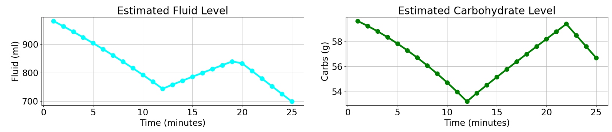

In the second setup, the system correctly handles mid-workout intake. When the
athlete consumes 300 ml of fluid and 15 g of carbohydrates halfway through the
workout, both graphs show a clear but smooth rise in levels. After this
increase, the model gradually absorbs these nutrients and returns to a declining
trend as the workout continues. The absorption is neither instantaneous nor
abrupt, matching real physiological behavior. Fluid and carb levels remain
stable with no spikes or distortions, confirming that the system handles intake
events realistically while maintaining continuous tracking. Setup 2 also meets
all success criteria, showing correct intake, absorption, and continued smooth
decline afterward.

#### Adaptive Recommendations (Minute-by-minute advice)

##### Goal

Verify that the system produces actionable hydration and carbohydrate advice at
least once per minute, expressed as hydration (milliliters) and carbohydrates
(grams) quantities, and that this advice adapts correctly to individual workout
variables.

##### Testing Strategy

Adaptive behavior is validated using **multiple short, controlled workouts**
instead of a single long session with many changing variables. Each workout
lasts **20 minutes** and starts from the **same baseline athlete state and
baseline workout profile**. Only **one variable is modified per workout**, while
all other inputs remain constant. This makes it possible to directly attribute
any change in hydration or carbohydrate recommendations to the modified variable
alone.

To verify athlete personalization, **only the baseline workout** is executed
multiple times with different athlete states (body weight, pre-workout
hydration, and pre-workout carbohydrate levels). All workout inputs remain
identical across these runs, ensuring that any differences in recommendations
are caused solely by athlete-specific parameters.

The following controlled workouts are used:

- **Baseline workout (reference condition)**

  - Duration: 20 minutes
  - Moderate, constant heart rate, speed, and temperature
  - No intake
  - Establishes stable baseline hydration and carbohydrate recommendations and
    serves as the reference for all adaptive tests

- **Heat adaptation workout**

  - Duration: 20 minutes
  - Temperature is gradually increased
  - Heart rate and speed remain identical to the baseline workout
  - Verifies that fluid recommendations increase in response to heat alone

- **Heart rate adaptation workout**

  - Duration: 20 minutes
  - Heart rate is gradually increased
  - Speed and temperature remain identical to the baseline workout
  - Verifies adaptation to increased physiological effort

- **Speed adaptation workout**

  - Duration: 20 minutes
  - Speed is gradually increased
  - Heart rate and temperature remain identical to the baseline workout
  - Verifies adaptation to increased mechanical workload

- **Intake during workout**

  - Duration: 20 minutes
  - Identical to the baseline workout
  - A single fluid and carbohydrate intake occurs halfway through the workout
  - Verifies that intake correctly influences subsequent recommendations

The test is considered successful if:

- A new hydration (ml) and carbohydrate (g) recommendation is produced at every
  one-minute update
- Recommendation changes are directly attributable to the single variable
  modified in each workout
- Intake events influence subsequent advice
- Identical baseline workouts produce different recommendation patterns for
  different athlete states

##### Setup

[Test here](./tests/adaptive_test_1.py)

```python
# Athlete state (switch manually)
state = AthleteState(weight_kg=70, pre_fluid_ml=1000, pre_carbs_g=60) # Average athlete, properly hydrated/fueled
# state = AthleteState(weight_kg=70, pre_fluid_ml=100, pre_carbs_g=5) # Average athlete, badly hydrated/fueled
# state = AthleteState(weight_kg=195, pre_fluid_ml=1000, pre_carbs_g=60) # Eddie Hall, "properly" hydrated/fueled

engine = HydrationFuelEngine(state)

# Generate workout data for all phases (switch manually)
workout_data_samples = []

# =================================================
# BASELINE WORKOUT (20 min)
# =================================================

for i in range(20):
    workout_data_samples.append(
        WorkoutData(
            heart_rate=135,
            speed=12.0,
            temperature=20.0
        )
    )


# =================================================
# HEAT ADAPTATION WORKOUT (20 min)
# =================================================

# temp = 20.0
# for i in range(20):
#     temp += 0.5
#     workout_data_samples.append(
#         WorkoutData(
#             heart_rate=135,
#             speed=12.0,
#             temperature=temp
#         )
#     )


# =================================================
# HEART RATE ADAPTATION WORKOUT (20 min)
# =================================================

# hr = 135
# for i in range(20):
#     hr += 2
#     workout_data_samples.append(
#         WorkoutData(
#             heart_rate=hr,
#             speed=12.0,
#             temperature=20.0
#         )
#     )


# =================================================
# SPEED ADAPTATION WORKOUT (20 min)
# =================================================

# speed = 12.0
# for i in range(20):
#     speed += 0.3
#     workout_data_samples.append(
#         WorkoutData(
#             heart_rate=135,
#             speed=speed,
#             temperature=20.0
#         )
#     )


# =================================================
# INTAKE DURING WORKOUT (20 min)
# =================================================

# for i in range(20):
#     workout_data_samples.append(
#         WorkoutData(
#             heart_rate=135,
#             speed=12.0,
#             temperature=20.0,
#             drink_ml=300 if i == 10 else 0,
#             eat_g=15 if i == 10 else 0
#         )
#     )

# =================================================
# MUCH LOWER INTAKE DURING WORKOUT (20 min)
# =================================================

# for i in range(20):
#     workout_data_samples.append(
#         WorkoutData(
#             heart_rate=135,
#             speed=12.0,
#             temperature=20.0,
#             drink_ml=100 if i == 10 else 0,
#             eat_g=5 if i == 10 else 0
#         )
#     )


# Simulate workout
for data_point in workout_data_samples:
    # Process a single workout data point (update state, calculate losses, advice, absorption)
    engine.update(data_point)

    # Store the calculated values for the graph
    ...

# This creates the nice plots with all the data displayed in it
create_very_nice_plot(...)
```

##### Results

###### Baseline

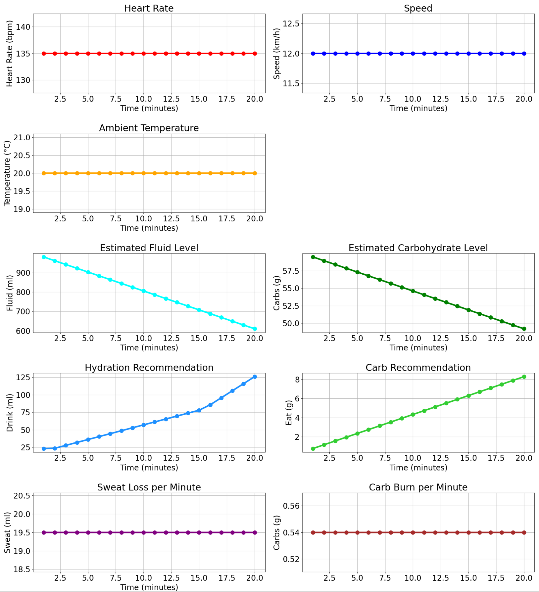

In this test, the system behaves correctly under constant workout conditions.
Hydration and carbohydrate recommendations are generated at every one-minute
update throughout the 20-minute session.

Hydration advice increases steadily over time with no sudden jumps or drops.
This shows that the system remains stable when heart rate, speed, and
temperature do not change.

Carbohydrate advice follows the same pattern, increasing smoothly at each
minute. No irregular values or gaps are observed.

Overall, the baseline test confirms that the system produces consistent,
predictable recommendations under steady conditions and provides a reliable
reference for comparison with all other tests.

###### Heat Adaptation

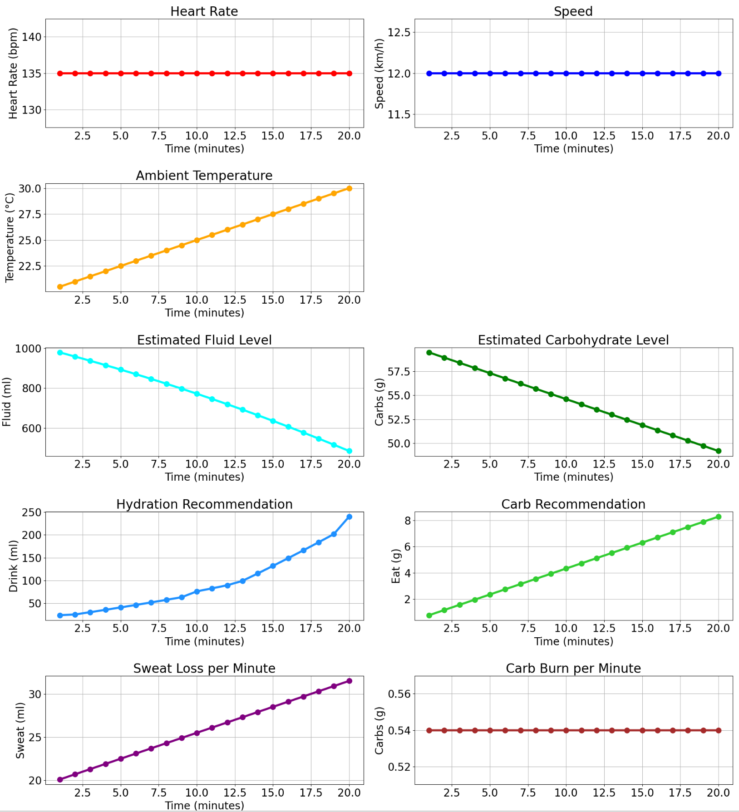

Compared to the baseline workout, the heat adaptation test shows a clear and
direct increase in hydration recommendations while carbohydrate advice remains
largely unchanged.

As temperature rises over the 20-minute session, hydration advice increases more
steeply than in the baseline case. This indicates that the system correctly
responds to heat stress by recommending additional fluid, even though heart rate
and speed stay constant. The hydration curve remains smooth, with no sudden
spikes or instability.

This behavior aligns with the underlying estimates: as temperature increases,
the estimated sweat loss per minute also rises steadily, clearly visible in the
sweat-loss graph. In contrast, carbohydrate recommendations closely match the
baseline pattern and continue to increase at a similar rate, confirming that
carbohydrate advice is not influenced by temperature alone.

Overall, this test confirms that the system isolates temperature as an adaptive
trigger: hydration recommendations increase in response to higher sweat loss
from heat, while carbohydrate recommendations remain stable.

###### Heart Rate Adaptation


Compared to the baseline workout, increasing heart rate leads to higher
hydration and carbohydrate recommendations over the same 20-minute period.

As heart rate rises while speed and temperature remain constant, hydration
advice increases more rapidly than in the baseline case. This aligns with the
underlying estimates: sweat loss per minute increases steadily as heart rate
rises, which is clearly reflected in the hydration recommendations. The
hydration curve remains smooth and stable throughout.

Carbohydrate recommendations also diverge from the baseline pattern as the
workout progresses. As heart rate increases, the estimated carbohydrate burn per
minute rises, leading the system to gradually recommend larger carbohydrate
amounts. This confirms that carbohydrate advice responds to physiological effort
rather than time alone.

Overall, this test demonstrates that the system adapts both hydration and
carbohydrate advice in response to increased heart rate, with recommendation
changes clearly driven by rising sweat loss and carbohydrate burn while
maintaining consistent minute-by-minute output.

###### Speed Adaptation

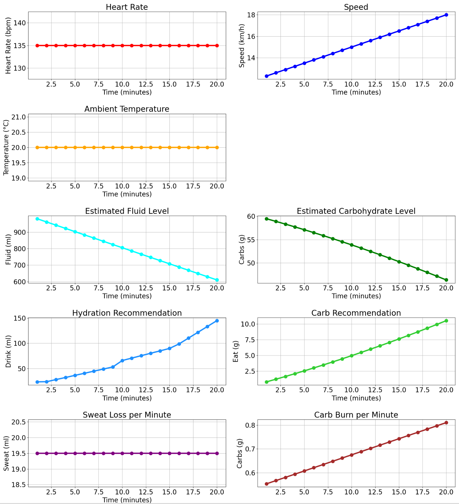

Compared to the baseline workout, increasing speed results in higher hydration
and carbohydrate recommendations over the same 20-minute period.

As speed increases while heart rate and temperature remain constant, hydration
advice rises only slightly compared to the baseline case. This indicates that
increased mechanical workload has a limited direct effect on fluid needs when
heart rate and heat remain unchanged. The hydration curve remains smooth and
stable throughout.

In contrast, carbohydrate recommendations diverge more clearly from the baseline
pattern. As running speed increases, the estimated carbohydrate burn per minute
rises steadily, which is clearly visible in the carb-burn graph. In response,
the system gradually recommends larger carbohydrate amounts, reflecting the
higher energy demand associated with greater mechanical effort.

Overall, this test confirms that the system responds to increased speed
primarily through higher carbohydrate recommendations, with only a modest
increase in hydration advice, while maintaining consistent minute-by-minute
output.

###### Intake during workout

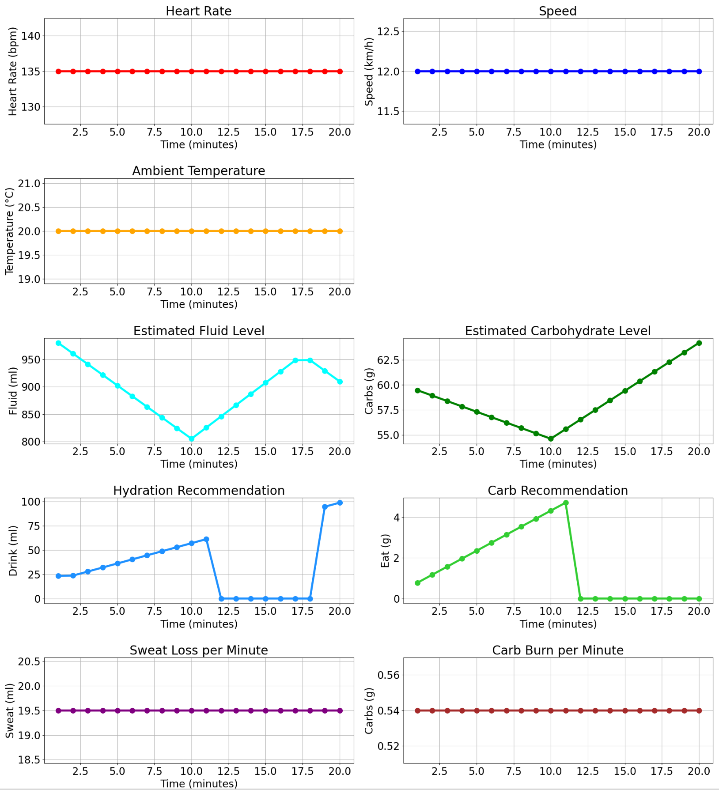

Compared to the baseline workout, the intake test shows a clear interruption in
both hydration and carbohydrate recommendations immediately after the athlete
consumes fluid and carbohydrates halfway through the session.

Before the intake event, hydration and carbohydrate advice follow the same
steady, increasing pattern as in the baseline case. At the moment of intake,
both recommendations drop sharply to 0, indicating that the system correctly
accounts for the consumed fluid and carbohydrates and temporarily stops
recommending additional intake.

After the intake event, hydration advice resumes later in the workout and
increases again, while carbohydrate recommendations remain at 0 for the
remainder of the 20-minute session. This occurs because carbohydrate absorption
is slower, meaning the previously consumed carbohydrates continue to cover the
athlete’s needs throughout the rest of the workout. This behavior differs
clearly from the baseline case, where both recommendations continue to rise
steadily over time.

This behavior is also visible in the internal state estimates: the estimated
fluid and carbohydrate levels increase immediately after intake, confirming that
the consumed nutrients are correctly added to the system state before subsequent
recommendations are generated.

Overall, this test confirms that, relative to baseline, the system correctly
incorporates in-workout intake into its recommendation logic and adjusts
subsequent advice accordingly, while still producing consistent minute-by-minute
output.

###### Lower Intake during workout

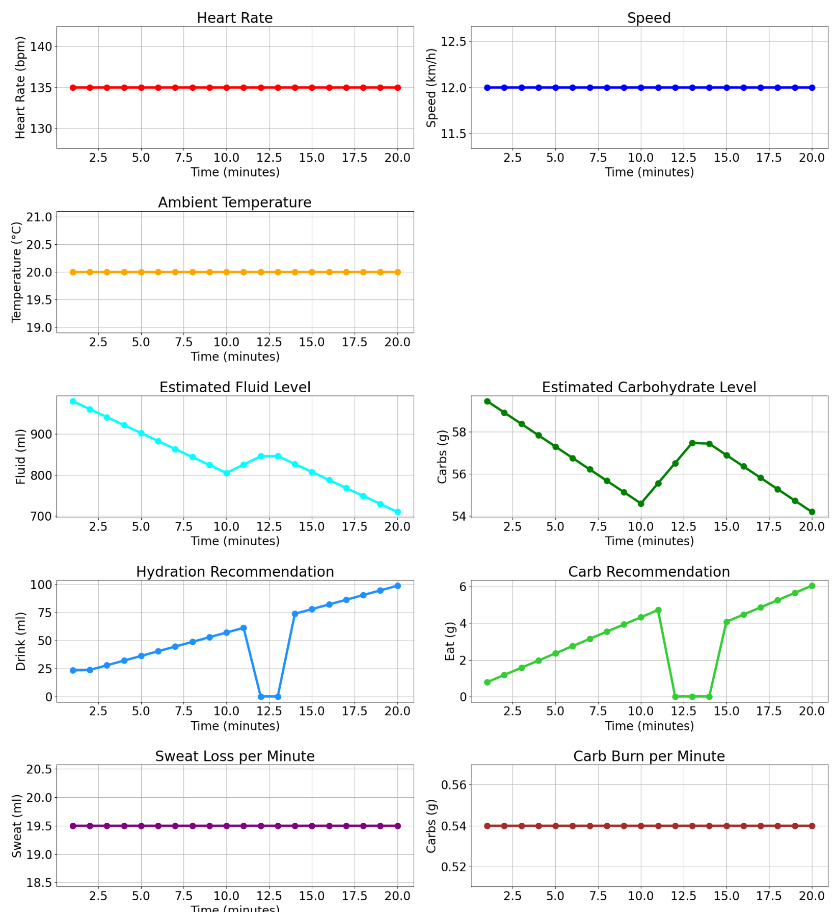

Compared to the normal intake scenario, this test uses a smaller mid-workout
fluid and carbohydrate intake under otherwise identical conditions.

As a result, the interruption in recommendations is noticeably shorter.
Hydration advice drops to 0 after intake but resumes sooner than in the normal
intake case, since the smaller fluid volume is absorbed more quickly. The
hydration curve therefore shows a brief dip rather than a prolonged zero-advice
plateau.

Carbohydrate recommendations show the same pattern. After intake, carb advice
temporarily falls to 0, but because fewer carbohydrates were consumed, the
absorption window clears earlier and recommendations resume within the same
20-minute session. This contrasts with the normal intake test, where carb
recommendations remain suppressed for much longer.

The internal state estimates support this behavior: estimated fluid and
carbohydrate levels increase after intake but decline again more rapidly than in
the normal intake case, allowing recommendations to restart sooner.

Overall, relative to a normal intake, this test confirms that the system scales
its suppression period with intake size, correctly resuming hydration and
carbohydrate recommendations earlier when smaller amounts are consumed.

###### Baseline Badly Hydrated

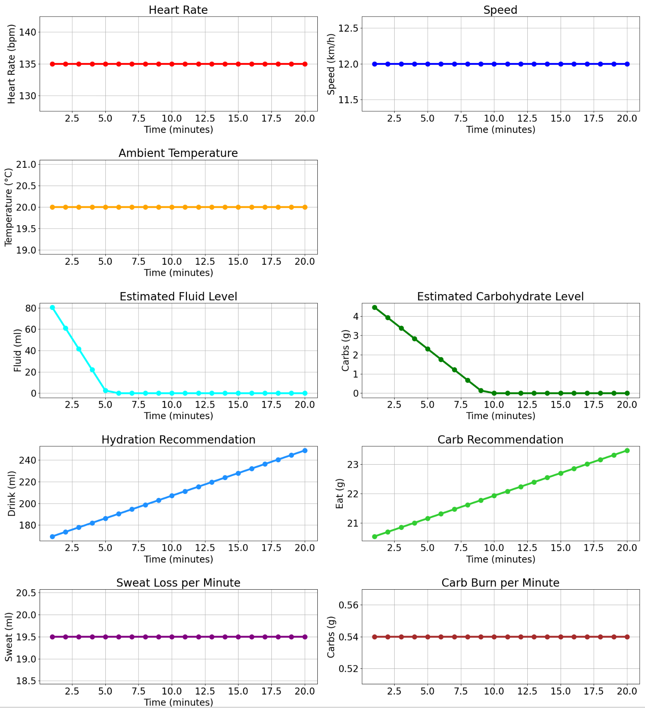

Compared to the normal baseline, this test starts from extremely low pre-workout
fluid and carbohydrate levels, which is clearly visible in the estimated
internal level graphs reaching near zero early in the session.

As expected, both hydration and carbohydrate recommendations are higher across
the entire 20-minute workout, with both curves shifted upward relative to
baseline. Hydration advice increases smoothly over time, indicating that the
system accounts for the initial hydration deficit under otherwise unchanged
conditions.

Carbohydrate recommendations show a similar upward shift, reflecting the very
low starting carbohydrate level. The progression remains stable with no
irregular behavior.

Given how low the initial internal fluid and carbohydrate levels are, the
recommendation magnitudes could reasonably be expected to be higher, especially
early in the workout. Overall, the test confirms correct personalization based
on pre-workout state while highlighting conservative behavior under severe
deficits.

###### Baseline Heavy Athlete

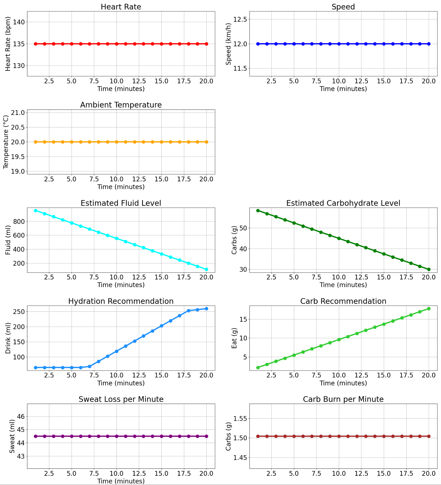

Compared to the baseline workout with an average-weight athlete, this test uses
a much heavier athlete while keeping pre-workout hydration and carbohydrate
levels in the same normal range. Under identical workout conditions, both
hydration and carbohydrate recommendations start substantially higher than in
the baseline case.

At the beginning of the workout, both hydration and carbohydrate recommendations
are roughly four times higher than in the baseline scenario. This immediate
difference reflects direct scaling with athlete body weight rather than gradual
accumulation over time.

This behavior is supported by the underlying estimates: the sweat loss per
minute is significantly higher for the heavier athlete, and the carbohydrate
burn per minute is also markedly elevated compared to baseline. These higher
absolute losses explain the stronger hydration and fueling recommendations
despite identical heart rate, speed, and temperature.

As the workout progresses, hydration advice continues to increase more steeply
than in the baseline scenario while remaining smooth and stable. Carbohydrate
recommendations follow a similarly shifted pattern, maintaining consistent
minute-by-minute increases.

Overall, this test confirms that the system correctly accounts for substantially
higher sweat loss and carbohydrate burn associated with greater body mass,
producing stronger initial and ongoing recommendations while preserving stable
and predictable behavior.

#### Stay aligned with science-informed hydration and fueling limits

##### Goal

Verify that all hydration and carbohydrate advice generated by the system stays
within the science-informed limits defined for this prototype to ensure safe and
physiologically appropriate recommendations.

##### Testing Strategy

To verify alignment with these science-informed prototype limits, a single
targeted test scenario is used. This scenario combines repeated fluid and
carbohydrate intake during a long, high-intensity workout, allowing all
hydration and fueling safety constraints to be evaluated under the same
conditions. The goal is to stress-test every limit while keeping the setup
simple and consistent.

| **Guideline Category**  | **What It Tests**                                                                                                                                                                                                                                  |
| ----------------------- | -------------------------------------------------------------------------------------------------------------------------------------------------------------------------------------------------------------------------------------------------- |
| **Hydration limits**    | - Hydration advice per update never exceeds **750 ml**<br>- The system never recommends drinking once hourly absorbed fluid exceeds **1,500 ml**<br>- The system does **not** recommend new fluid until the previous drink has been fully absorbed |
| **Carbohydrate limits** | - Carb advice per update never exceeds **60 g**<br>- Hourly absorbed carbohydrates never exceed **120 g**<br>- The system does **not** recommend new carbohydrate intake until previously consumed carbs have been fully absorbed                  |

The test is considered successful if all of these constraints are respected
throughout the scenario, with no recommendation or absorbed total violating the
prototype’s defined safety limits.

##### Setup

[Test here](./tests/sport_guidelines_test.py)

```python
# Simulated workout data
workout_data_samples = []

hrate = 165
speed = 15.5
temp = 28.0

for i in range(60):  # 60 minutes
    workout_data_samples.append(
        WorkoutData(
            heart_rate=hrate,
            speed=speed,
            temperature=temp,
            drink_ml=0,
            eat_g=None
        )
    )

    # Keep intensity and heat high
    hrate = min(hrate + 1, 180)
    speed = min(speed + 0.05, 17.0)
    temp = min(temp + 0.05, 32.0)

for i in range(90):  # 90 minutes
    workout_data_samples.append(
        WorkoutData(
            heart_rate=hrate,
            speed=speed,
            temperature=temp,
            drink_ml=750 if i == 0 or i == 30 else 0,   # Drink 1500ml (half at minute 60, half at minute 90)
            eat_g=60 if i == 0 or i == 30 else 0 # Eat 120g (half at minute 60, half at minute 90)
        )
    )

# Simulate workout
for data_point in workout_data_samples:
    # Process a single workout data point (update state, calculate losses, advice, absorption)
    engine.update(data_point)

    # Store the calculated values for the graph
    ...

# This creates the nice plots with all the data displayed in it
create_very_nice_plot(...)
```

##### Results

###### Workout conditions

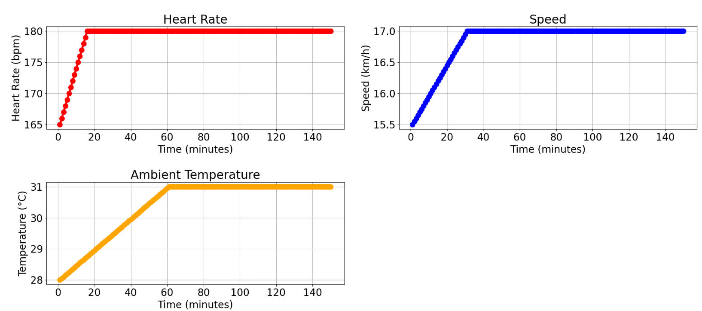

This test simulates an intentionally extreme endurance scenario. Heart rate
rises quickly to a very high level and then remains near maximal for most of the
session, while running speed also increases early and stabilizes at a sustained
high pace. At the same time, ambient temperature steadily rises into a hot range
and remains elevated for the duration of the workout. Together, these conditions
create a prolonged combination of high cardiovascular strain, high mechanical
workload, and significant heat stress, resulting in exceptionally high sweat
loss and energy expenditure rates. This setup is designed to stress-test the
system’s safety limits rather than represent a typical or easily sustainable
workout.

###### Hydration limits

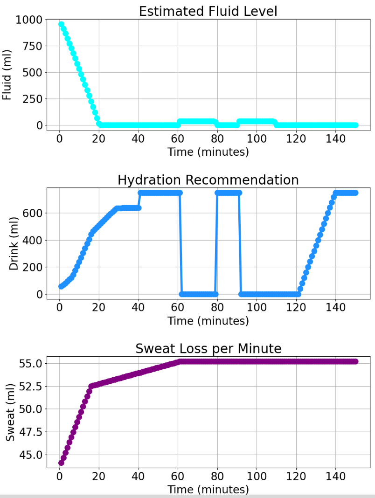

In this case, the system follows all hydration safety rules exactly as intended.
As workout intensity and temperature rise, the engine gradually increases its
drinking recommendations up to the 750 ml per-drink cap but never exceeds it.
Once the athlete consumes a drink, the recommendation immediately drops to 0 ml,
and the system does not advise drinking again until the previously consumed
fluid has been fully absorbed. Because the hydration model absorbs water at a
fixed rate of 40 ml per minute, this creates the long zero-advice plateau
between roughly minute 60 and minute 80, where absorption constraints correctly
override sweat loss and intensity effects.

After the first 750 ml intake has been absorbed, the system resumes increasing
its advice and again approaches the 750 ml upper limit without crossing it. A
second intake occurs later in the session, but the recommendation remains at 0
ml for an extended period because the hourly absorbed fluid total exceeds the
1,500 ml safety threshold. Only once this rolling total drops below the limit
does hydration advice resume.

Under the extreme conditions simulated in this test, sweat loss per minute is
consistently higher than the rate at which fluid can be absorbed. As a result,
the estimated internal fluid level is unable to recover meaningfully and remains
near zero for much of the workout despite repeated intake events. This behavior
is clearly visible in the fluid-level graph and reflects a physiological
bottleneck rather than a failure of the safety logic.

It is important to note that only a very small subset of athletes could
realistically sustain such extreme combinations of intensity, heat, and sweat
loss for this duration. In these edge cases, the model may produce less accurate
absolute fluid-level estimates, even though the safety constraints and decision
logic remain correct.

Overall, this test highlights two key points: first, that the hydration safety
rules behave exactly as designed under extreme stress; and second, that the
model is not universal. These results strongly suggest that absorption rates and
loss parameters should be tuned per individual athlete to improve accuracy under
extreme or atypical conditions, rather than relying on a single fixed
physiological model for all users.

###### Carbohydrate limits

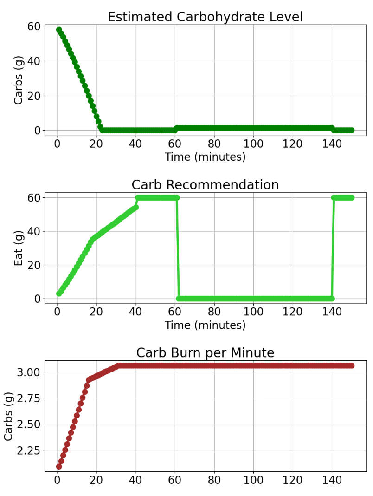

In this case, the carb system behaves exactly the way the rules expect. At the
start of the workout, the recommendations slowly increase as the athlete uses
more carbs, and they eventually reach the 60 g per-intake limit, but never go
over it. This shows that the per-update maximum is working correctly.

When the athlete eats 60 g at minute 60, the recommendation instantly drops to 0
g. The system then stays at 0 because it’s not allowed to recommend more carbs
until the previous snack has been fully absorbed. Since carbohydrate absorption
is slow in this model (1.5 g per minute), the first 60 g is still not absorbed
by minute 90. When another 60 g is consumed at that point, the system continues
recommending 0 g, confirming that the “no recommendation until absorbed” rule is
applied correctly.

As with hydration under extreme conditions, the results clearly show that
carbohydrate burn can exceed what the model is able to absorb. This causes
estimated carb levels to remain low and keeps recommendations suppressed for a
long period, even after intake. Only a small number of athletes could
realistically sustain such conditions, and under these extremes the model may
produce physiologically unrealistic outcomes. This highlights that, like
hydration, the carbohydrate model is not universal and would need individual
tuning for extreme workloads.

Overall, the test shows that the carb logic behaves correctly: it stays under
the per-snack maximum, waits for absorption before recommending more, and
naturally remains below the hourly absorption limit.

### Critical Analysis of the Solution’s Fitness

The solution was evaluated on two main fronts: computational efficiency and
overall capability to meet the real-time performance requirement. From a
performance perspective, the system demonstrates extremely low processing
overhead. Each workout data point is processed in 0.00–0.03 ms, with an average
of 0.01 ms, which is effectively negligible and far below any real-time
constraint. This comfortably meets the success criterion that each update must
complete within 1 second. The update step consists of constant-time arithmetic
operations and manages only fixed-size 60-entry histories, which represent the
absorption window for the last 60 minutes (one data point per minute). Because
these histories never grow beyond 60 items, both time and space complexity
remain O(1) per update, ensuring scalability regardless of workout duration.

Theoretically, the system could be configured to process data more frequently,
for example, once per second rather than once per minute. This would increase
the number of absorption entries from 60 per hour to 3,600 per hour, and in turn
slightly increase processing time. However, such rapid intake events (eating or
drinking every second) are not realistic in real-world workouts. The prototype
is intentionally designed around one-minute ticks, which match typical
endurance-training data resolution and make the fixed 60-entry window
appropriate and efficient. Under these assumptions, the solution performs well
within all required constraints and remains robust for its intended use case.

Overall, the solution is computationally efficient, stable, and suited for
real-time hydration and fueling estimation. While the physiological model could
be expanded for higher accuracy, the current implementation demonstrates strong
fitness for the intended purpose of delivering lightweight, minute-by-minute
recommendations.

## Conclusion

This project successfully delivered a working prototype within the three-week
timeframe that provides real-time, personalized hydration and carbohydrate
recommendations during endurance workouts. The system processes live workout
data efficiently, continuously tracks estimated internal fluid and carbohydrate
levels, reacts correctly to eating and drinking events, and generates
minute-by-minute advice expressed in clear, actionable quantities. All real-time
performance requirements were met comfortably, with processing times far below
the defined limits.

The testing results show that the model behaves in a scientifically plausible
and internally consistent way. Fluid and carbohydrate estimates change smoothly
over time, respond logically to changes in heart rate, speed, temperature, body
weight, and intake events, and remain within the science-informed safety limits
defined for the prototype. Under normal and moderately demanding conditions, the
model produces values that align well with ranges reported in the sports-science
literature, making it suitable as a practical estimation tool rather than a
precise physiological simulator.

At the same time, the tests clearly demonstrate that the model is not
universally perfect for all athletes and all conditions. Under extreme
scenarios, such as very high body mass, severe pre-workout deficits, or
prolonged combinations of high intensity and heat, the model can produce values
that may be too conservative in some cases or overly aggressive in others. These
outcomes highlight the inherent limitations of using simplified, fixed
coefficients to represent complex human physiology. They also show that
individual differences in sweat rate, carbohydrate metabolism, and absorption
capacity cannot be fully captured by a single generic model.

Despite these limitations, the most important outcome is that for a large group
of typical endurance athletes, particularly average-weight individuals training
at common endurance intensities, the model provides a reasonable and useful
representation of what is happening internally during a workout. It offers
timely guidance that adapts to changing conditions while respecting safety
constraints, which is precisely the intended role of a real-time training
support tool.

In conclusion, the prototype meets its defined goals: it is fast, adaptive,
safe, and scientifically grounded. While future work could improve accuracy by
adding individual calibration, learning from historical data, or integrating
additional physiological signals, this implementation demonstrates that even a
lightweight model can deliver meaningful and actionable hydration and fueling
guidance within strict development constraints.

## Future Research

This prototype focuses on providing reasonable, real-time estimates rather than
precise physiological accuracy. The current approach uses simplified rule-based
and mathematically lightweight models that behave realistically but are not
personalized to each athlete’s unique biology. For future research, more
advanced methods could be explored to increase accuracy.

Improving the physiological realism of such a system would require approaches
beyond the scope of this 3-week prototype. More sophisticated techniques, such
as machine learning models or detailed physiological simulations could offer far
more accurate and individualized predictions. However, they require large
amounts of high-quality data, repeated athlete-specific testing, and scientific
equipment such as sweat-rate sensors, metabolic carts, or lab-grade glycogen
measurements. These methods are powerful but resource-intensive, making them
unsuitable for a lightweight proof-of-concept.

Another potential direction is the development of an algorithm that predicts the
optimal timing for rehydration or carbohydrate intake. Rather than relying
solely on reactive thresholds, the system could forecast future hydration and
carbohydrate levels and issue recommendations before the athlete reaches a
critical point. This would require integrating effort forecasting, environmental
factors, and absorption timing into a predictive decision-making system, an
interesting but non-trivial extension for future work.

Both of these directions were outside the scope of this short development
period, especially since a functioning simulation environment first had to be
built before any higher-level modeling could even be explored. Given this
constraint, the focus remained on creating a reliable real-time system rather
than developing athlete-specific physiological models or predictive intake
algorithms. The current design therefore offers rough but practical estimates
suitable for live workout feedback, while leaving substantial room for more
advanced, personalized, and predictive modeling in future iterations.

## Help received

I did not receive help from anyone during this part, except for guidance from
teachers who helped me shape the testing approach and provided advice on how to
write the report. All design choices were developed independently, using
information derived from the cited research papers and academic sources.
