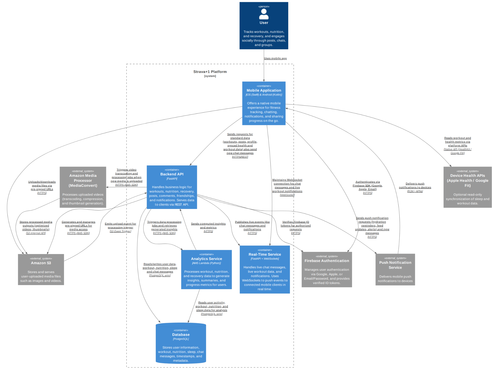

## Introduction

The purpose of this technical design is to define the architecture, structure,
and key implementation details of the Strava+1 fitness and social tracking
application. The platform enables users to monitor workouts, nutrition, and
recovery while engaging socially through posts, likes, comments, and group
interactions.

This TD outlines the core system components, data models, and relationships that
support these functionalities, ensuring scalability, security, and reliability
across the platform.

## System Functionality

The system functions as an all-in-one platform for fitness tracking, nutrition
management, recovery monitoring, and social engagement. It integrates multiple
health and lifestyle features to give users a complete overview of their
well-being and progress.

Users can create an account, customize their profile, and configure preferences
such as units, language, and notification settings. They can log various types
of workouts including running, cycling, and swimming, with detailed metrics such
as distance, duration, elevation, heart rate, and perceived exertion. Each
workout can include GPS data for route visualization and be reviewed afterward
with performance summaries and personalized insights. Additionally, workouts
recorded using third-party services like Apple Health or Google Fit can be
imported into the app, allowing users to review all their training data in one
place.

The application also allows users to track recovery by logging their sleep
duration and quality, helping them monitor rest patterns over time. While sleep
can be entered manually or estimated using phone activity patterns (for example,
the time between last and first device interactions), this approach is less
precise than data collected by wearables. To improve accuracy, the app could
optionally synchronize with native health services such as Apple Health or
Google Fit, allowing users to import verified sleep and recovery data from their
smartwatch or fitness tracker through their respective APIs.

Beyond personal tracking, the platform emphasizes community and motivation.
Users can share their activities as posts, like and comment on others’ workouts,
and follow friends to stay connected. A chat feature enables direct and group
communication, supporting both one-on-one conversations and fitness-related
group discussions. These social interactions help users stay engaged, build
accountability, and maintain consistent training habits.

Analytics continuously processes user data such as workouts, nutrition, and
sleep patterns to generate personalized insights and summaries. It highlights
performance trends, recovery progress, and training balance, helping users make
data-driven decisions about their health and fitness. Theses are displayed
within the mobile app’s dashboards.

Personalized insights derived from logged data such as workouts, nutrition, and
recovery help users better understand their performance trends and promote
long-term healthy behavior.

For a detailed overview of user interactions and interface flow, refer to the
[Figma prototype](https://www.figma.com/proto/f6jB5vUjyB7yVAW8cT7QDW/Strava-1?node-id=16-252&p=f&t=vMX2EYy61Wszxy3y-1).

## Technical overview

## Design choices

### Mobile Application

| Alternative                       | Rating | What                                                                                                                                                                                                           |
| --------------------------------- | -----: | -------------------------------------------------------------------------------------------------------------------------------------------------------------------------------------------------------------- |
| Native (Swift & Kotlin)           |    +++ | Works really fast and smooth, full access to all phone features like HealthKit, GPS, sensors, notifications. Harder to make because you need to write two apps (iOS and Android) and know both platforms well. |
| Flutter                           |     ++ | Can use one code for both iOS and Android, UI looks the same on both. Fast to make and works well for most things. Some advanced phone features need extra plugins, app can be a bit bigger.                   |
| React Native                      |     ++ | Good for quickly making apps, lots of ready-to-use components, hot reload helps testing. Some advanced sensors need extra code, not as smooth for heavy animations or fast telemetry.                          |
| Kotlin Multiplatform Mobile (KMM) |     ++ | You can share the core app logic between iOS and Android but keep native UIs. UI still needs two codebases, KMM is newer so fewer plugins and examples.                                                        |
| Progressive Web App (PWA)         |      + | One web code works on any device, easy to update. Can’t use all phone features, no background GPS or HealthKit, not good for heavy tracking or offline use.                                                    |

Choice: Native (Swift for iOS, Kotlin for Android)

Motivation: For a fitness app where we need accurate GPS tracking, good battery
life, background processing, and full access to HealthKit / Google Fit, using
native code is the most reliable. Native apps let us make the app faster and use
less battery, get data from sensors and background tasks without tricky
workarounds, and give users a UI that feels natural for each platform. Even
though we have to write more code and work on two apps (iOS and Android), the
better accuracy, performance, and control make native the best long-term choice
for Strava+1.

### Authentication

| Alternative                      | Rating | What                                                                                                                                                                                                            |
| -------------------------------- | -----: | --------------------------------------------------------------------------------------------------------------------------------------------------------------------------------------------------------------- |
| Firebase Authentication          |    +++ | Easy and secure authentication for mobile apps. Supports Google, Apple, and email/password sign-in. Provides verified ID tokens for backend requests. Reduces the amount of code we need to write and maintain. |
| Custom Backend Authentication    |     ++ | Build our own login system on the backend. Gives full control over security and features. Takes more time to implement, test, and maintain, and is more error-prone.                                            |
| OAuth 2.0 Providers (standalone) |     ++ | Let users sign in with Google, Facebook, or other OAuth providers. Works across platforms. Requires extra backend logic to manage tokens and users.                                                             |
| Auth0 / Third-party Service      |     ++ | Ready-made authentication and authorization service. Easy to integrate, supports multiple providers. Can be expensive at scale, adds a dependency on an external service.                                       |

Choice: Firebase

Motivation: We use Firebase because it’s simple, secure, and works well on
mobile apps. Users can sign in with Google, Apple, or email/password, and the
backend gets verified ID tokens automatically. It saves us time, reduces
security risks, and integrates easily with both iOS and Android apps, letting us
focus on fitness features instead of building authentication from scratch.

### Backend API

| Alternative       | Rating | What                                                                                                                                                                                      |
| ----------------- | -----: | ----------------------------------------------------------------------------------------------------------------------------------------------------------------------------------------- |
| FastAPI           |    +++ | Really fast and works well with Python. Easy to make async endpoints for live chat, workout telemetry, and notifications. Auto-validates data and gives API docs, so less chance of bugs. |
| Django Ninja      |     ++ | Works on top of Django. Good if you already use Django ORM/admin. Async support is okay, but not as smooth for real-time stuff.                                                           |
| Flask             |      + | Simple Python framework. Needs extra work for async stuff and real-time updates. Less built-in validation and docs.                                                                       |
| Node.js / Express |     ++ | JavaScript framework, pretty fast and async by default. Would need extra Python integration for analytics/workers.                                                                        |
| Go / Gin          |     ++ | Super fast and handles lots of users easily. Harder to integrate with Python services and analytics.                                                                                      |
| .NET / .NET Core  |      + | C# framework, good for teams familiar with Microsoft stack. Supports APIs and async programming, but heavier and less commonly used for Python-based microservices and analytics.         |

Choice: FastAPI

Motivation: I picked FastAPI because it’s fast, works great with Python, and
makes async stuff easy. This is important for live chat, workout notifications,
and telemetry data that updates in real time. FastAPI also checks incoming data
and automatically creates API documentation, which saves time and helps avoid a
lot of common mistakes. Other options like Django Ninja or Flask could also
work, but they’re either slower for async features or need more setup and code.
Node.js or Go are fast too, but since Python is the language I have the most
experience with, FastAPI is the best fit for me and the project.

### Real-Time service

| Alternative          | Rating | What                                                                                                                                                                                   |
| -------------------- | -----: | -------------------------------------------------------------------------------------------------------------------------------------------------------------------------------------- |
| FastAPI + WebSockets |    +++ | Python-based, supports async WebSocket connections for chat, live workout telemetry, and notifications. Works well with backend API and Python services. Can scale with Redis Pub/Sub. |
| Socket.IO (Python)   |     ++ | Handles WebSockets with fallback to long polling. Easier chat/room management, but adds an extra library and slightly more complexity.                                                 |
| Node.js + Socket.IO  |     ++ | Popular for real-time apps, fast and async by default. Would require integrating with Python backend for analytics/workers.                                                            |
| Django Channels      |      + | Works only with Django, less relevant for a FastAPI-based system. Async support exists but more coupled to Django ecosystem.                                                           |

Choice: FastAPI + WebSockets

Motivation: I chose FastAPI + WebSockets because it fits naturally with our
Python backend. It lets us handle live chat messages, workout telemetry, and
notifications in real time without adding another language or framework. It also
supports async connections. Socket.IO or Node.js could work, but using Python
everywhere keeps things simpler and easier to maintain.

### Database

| Alternative        | Rating | What                                                                                                                                                          |
| ------------------ | -----: | ------------------------------------------------------------------------------------------------------------------------------------------------------------- |
| PostgreSQL         |    +++ | Reliable, open-source relational database. Great for structured data like users and chat messages. Supports indexes, transactions, and JSON fields if needed. |
| MySQL / MariaDB    |     ++ | Another solid relational database. Works well but PostgreSQL has slightly better JSON/advanced features.                                                      |
| MongoDB            |      + | NoSQL, stores JSON-like documents. Flexible for unstructured data, but not ideal for structured user/chat data.                                               |
| Firebase Firestore |     ++ | Cloud-hosted NoSQL, easy integration with Firebase auth. Less control, costs scale with usage.                                                                |

Choice: PostgreSQL

Motivation: PostgreSQL is solid, fast, and works really well for storing
structured data like user profiles and chat messages. It supports transactions,
indexing, and complex queries, which makes it easier to keep data consistent and
query it efficiently. Unlike NoSQL solutions, it fits our relational data
naturally and integrates smoothly with our Python backend.

### Media storage

| Alternative      | Rating | What                                                                                                                  |
| ---------------- | -----: | --------------------------------------------------------------------------------------------------------------------- |
| Amazon S3        |    +++ | Highly scalable, durable, and cost-effective object storage with mature SDK support and secure pre-signed URL access. |
| Firebase Storage |     ++ | Good integration with Firebase ecosystem, but limited flexibility and vendor lock-in.                                 |
| PostgreSQL BLOBs |      + | Keeps data consistent but inefficient for large binary files and increases database load.                             |

Choice: Amazon S3

Motivation: Amazon S3 provides reliable, scalable, and globally available
storage for large user-uploaded media such as images and videos. Using S3 with
pre-signed URLs allows the mobile app to upload and download media directly,
reducing backend load and bandwidth usage.

### Video processor

| Alternative         | Rating | What                                                                                                                                                                                                                                            |
| ------------------- | -----: | ----------------------------------------------------------------------------------------------------------------------------------------------------------------------------------------------------------------------------------------------- |
| Amazon MediaConvert |    +++ | Fully managed AWS service for video transcoding and processing. Converts uploaded videos into multiple resolutions and formats, generates thumbnails, and integrates directly with S3. Scales automatically and supports event-based workflows. |
| FFmpeg on EC2       |     ++ | Self-managed solution using FFmpeg for transcoding. Provides flexibility but requires managing infrastructure, scaling, and error handling manually. More maintenance overhead.                                                                 |
| Elastic Transcoder  |      + | Older AWS service for video transcoding. Still functional but less feature-rich than MediaConvert and considered legacy.                                                                                                                        |

Choice: Amazon MediaConvert

Motivation: I chose Amazon MediaConvert because it provides a fully managed,
scalable, and integrated solution for video transcoding within AWS. It connects
directly with S3, allowing the backend to trigger processing jobs automatically
when users upload videos. It supports generating optimized playback formats,
thumbnails, and adaptive bitrate streaming outputs, ensuring smooth video
delivery across different devices and networks. Compared to self-hosted FFmpeg
or older AWS services, MediaConvert reduces operational complexity.

### Analytics Service

| Alternative                      | Rating | What                                                         |
| -------------------------------- | -----: | ------------------------------------------------------------ |
| AWS Lambda                       |    +++ | Event-driven serverless compute for data processing          |
| AWS Glue                         |     ++ | Managed ETL service, better for large-scale data pipelines   |
| Google Cloud Functions           |     ++ | Similar to Lambda but outside AWS ecosystem                  |
| Self-hosted FastAPI microservice |      + | Custom analytics engine but requires maintenance and scaling |

Choice: AWS Lambda

Motivation: AWS Lambda fits well because it lets us run analytics tasks without
having to manage servers. It can automatically start when something happens in
our system, like when a user adds a new workout or nutrition entry. Lambda can
read the needed data from the database, calculate stats or summaries, and send
the results back to the backend. It also scales on its own when more users join,
so we don’t need to worry about setting up extra servers. Since we already use
other AWS services like S3 and MediaConvert, it fits smoothly into our setup and
keeps everything simple and low-cost.

### Mobile Application Protocol

| Alternative                   | Rating | What                                                                                                                                                               |
| ----------------------------- | -----: | ------------------------------------------------------------------------------------------------------------------------------------------------------------------ |
| HTTPS + REST API              |    +++ | Secure transport and standard API style for all normal requests like workouts, profiles, posts, and nutrition. Reliable for sending and receiving structured data. |
| GraphQL API                   |     ++ | Lets clients request exactly the data they need in a single query. Uses HTTPS underneath. Good for reducing over-fetching.                                         |
| WebSocket                     |     ++ | Real-time transport for chat messages and live workout notifications. Keeps a persistent connection so updates arrive instantly while the app is open.             |
| Push Notifications (FCM/APNs) |     ++ | Sends alerts like hydration reminders or feed updates even when the app is backgrounded. Works with mobile OS push services.                                       |
|                               |

Choice: HTTPS + REST for standard requests, WebSocket for live updates, and Push
notifications for background alerts.

Motivation: HTTPS + REST is secure and simple for normal requests like workouts,
nutrition, and profiles. WebSocket provides real-time chat and live workout
notifications, while push notifications ensure hydration and feed alerts reach
users while the app is running in the background during an active workout. This
gives a reliable, real-time, and responsive experience for the fitness app.

### Device integration Protocol

| Alternative                         | Rating | What                                                                                                                 |
| ----------------------------------- | -----: | -------------------------------------------------------------------------------------------------------------------- |
| Native API (HealthKit / Google Fit) |    +++ | Uses the built-in iOS and Android health APIs to read workout, step, and sleep data directly from the user’s device. |
| Direct backend sync                 |     ++ | Would require users to connect their Google/Apple accounts through the backend, adding extra setup and slower sync.  |
| Third-party SDK                     |      + | Could simplify integration but adds dependencies and limits flexibility.                                             |

Choice: Native API

Motivation: Using the native APIs (Apple HealthKit and Google Fit) allows the
app to securely and efficiently access health and workout data directly on the
device without going through external servers. It’s faster, more
privacy-friendly, and feels more “native” to each platform. The data then still
be synced to our backend later.

### Push notification Protocol

| Alternative                    | Rating | What                                                                                                                                              |
| ------------------------------ | -----: | ------------------------------------------------------------------------------------------------------------------------------------------------- |
| HTTPS / FCM / APNs             |    +++ | Backend sends HTTPS requests to FCM (Android) or APNs (iOS) which deliver push messages to devices. Reliable and works while app is backgrounded. |
| MQTT / Other Push Protocols    |     ++ | Lightweight messaging protocol, good for IoT or very fast updates. Less standard for mobile push.                                                 |
| Custom WebSocket Notifications |      + | Use your own WebSocket channel to push notifications. Only works when app is running and connected.                                               |

Choice: HTTPS / FCM / APNs

Motivation: Using the standard push services (FCM for Android, APNs for iOS) is
the most reliable and supported way to send notifications to mobile devices. It
works even when the app is in the background, handles device registration tokens
automatically, and doesn’t require maintaining a custom push infrastructure.
This fits our app’s needs for hydration reminders, feed updates, and alerts.

### Video Processing Protocol

| Alternative                            | Rating | What                                                                                                                                                                             |
| -------------------------------------- | -----: | -------------------------------------------------------------------------------------------------------------------------------------------------------------------------------- |
| S3 Event Trigger + HTTPS (AWS SDK)     |    +++ | The backend listens for S3 “upload completed” events and sends HTTPS job requests to AWS Elemental MediaConvert using the AWS SDK. Reliable, scalable, and fully managed by AWS. |
| Direct Upload to EC2 (FFmpeg)          |     ++ | Upload video directly to a compute instance that runs FFmpeg for transcoding. More control but higher maintenance and scaling effort.                                            |
| Serverless (AWS Lambda + FFmpeg Layer) |      + | Lightweight and cheaper for very short clips. Limited by Lambda execution time and memory, not suitable for long or large videos.                                                |

Choice: S3 Event Trigger + HTTPS (AWS SDK)

Motivation: When a user uploads a video, it first goes to S3. That upload
triggers an event that tells our backend (or MediaConvert) to start processing
the video. MediaConvert then converts the video into different sizes or formats
and saves the results back in S3. We use HTTPS with the AWS SDK to send these
jobs safely and easily. This setup means we don’t have to run our own video
servers, and it can automatically handle more uploads as the app grows.

### Database Protocol

| Alternative              | Rating | What                                                                               |
| ------------------------ | -----: | ---------------------------------------------------------------------------------- |
| PostgreSQL Wire Protocol |    +++ | Native protocol used by PostgreSQL clients to communicate efficiently with the DB. |
| REST API                 |     ++ | Generic database access methods. Works, but adds overhead or abstraction layers.   |
| ORM abstractions only    |      + | Using only ORM without specifying the underlying protocol. Can be less performant. |

Choice: PostgreSQL Wire

Motivation: Using the PostgreSQL wire protocol directly is the most efficient
way for the backend to talk to the database. It avoids extra layers or adapters,
reduces latency, and is fully supported by standard Python database clients.
This ensures fast reads/writes for both user data and chat messages, which is
important for real-time features like messaging.

## Security

Security in Strava+1 is handled at different levels to keep user data safe, make
sure users are logged in correctly, and protect communication between all parts
of the system.

### Authentication and Authorization

User login is managed by Firebase Authentication. Users can sign in with Google,
Apple, or email and password. Firebase takes care of password storage and
sign-in safety. When a user logs in, Firebase gives back a secure ID token
(JWT). The mobile app sends this token with every request to the backend in the
Authorization header. The backend checks the token with Firebase before doing
anything. This makes sure that only real, logged-in users can use the app’s
features or change their own data.

### Secure Communication (HTTPS and WebSocket)

All communication between the mobile app, backend, and other services uses
HTTPS, which means data is encrypted when it moves over the internet. For chat
messages and live workout updates, the app uses WebSockets, which also run over
a secure connection (WSS). This keeps real-time messages private and safe.

### Data Protection and Access Control

The main database (PostgreSQL) is placed inside a private network and cannot be
reached directly from the internet. Only the backend, real-time, and analytics
services can connect to it. Each service uses its own login details and can only
do what it needs to do. Database connections use SSL to keep the data encrypted,
even inside the private network.

### Media and File Security

User photos and videos are stored in Amazon S3. They are private by default and
can’t be viewed by anyone else. The backend creates short-lived pre-signed URLs
for uploading or downloading files. These URLs expire after a short time, so
they can’t be reused. When a new video is uploaded, S3 sends an event that
starts MediaConvert to process the video and make different sizes or thumbnails.
These services talk to each other safely inside AWS without exposing data to the
public.

### Push Notifications and External Services

The backend sends push notifications through FCM (Android) and APNs (iOS). The
app never stores secret keys; they are kept safe on the server. Health data from
Apple HealthKit or Google Fit is only accessed when the user gives permission.
The app always asks before reading this kind of data.

### Data Privacy and Storage

Passwords and tokens are never stored in our own database. Firebase handles all
login and password data. The database only keeps what is needed, like workouts,
sleep logs, nutrition info, and chat messages. All stored data is encrypted and
backed up regularly to prevent data loss.

### Internal Service Security

The backend, analytics, and real-time services talk to each other over secure
HTTPS connections. Each service has its own access keys with limited
permissions. No service can directly access another one’s internal data unless
it’s through an approved and secure request.

## Scalability and Reliability

If the Strava+1 platform had to handle a huge number of users (like millions) or
needed to be online 24/7 with almost no downtime, I would make some changes to
improve scalability and reliability.

### Global Scalability

For global users, we could use a Content Delivery Network (CDN) like Amazon
CloudFront to serve media and static content (such as images, videos, and
analytics dashboards) from edge locations closer to the user. This reduces
latency, speeds up content delivery, and improves reliability by ensuring that
requests are served even if the main backend temporarily goes offline. Combined
with global DNS routing, this would make the platform responsive and consistent
across different regions.

### Backend and Services

Right now, our backend API and real-time service could run on a few containers
or servers. For extreme scalability, we would move them behind a load balancer
so that traffic can be spread across multiple instances. When user traffic
increases, new containers or instances can automatically start up (autoscaling).
If one instance fails, the load balancer can reroute traffic to the healthy
ones, keeping the app online.

For reliability, we could deploy the backend across multiple availability zones
(AZs) inside AWS. This means even if one data center goes down, the app still
works from another one.

### Database, Caching, and Performance

The PostgreSQL database might become a bottleneck when many users are active.
We’d switch to a managed PostgreSQL service like Amazon RDS, which handles
automatic backups, replication, and scaling. We could enable read replicas to
handle heavy read traffic (like users viewing workouts) and use connection
pooling, which means keeping a shared pool of open database connections that can
be reused instead of opening a new one for every request. This helps avoid
hitting connection limits and improves performance when many users are online.

To make the app even faster, we could add a cache layer like Redis or AWS
ElastiCache. This would store frequently used data (like user profiles or feed
posts) in memory so the backend can return them quickly without querying the
main database every time.

If traffic keeps growing, we’d also start splitting data into different
databases instead of keeping everything in one place. For example, chat messages
could be moved to a Redis database, which is much faster for handling large
amounts of real-time data and frequent reads/writes. Redis keeps data in memory,
making it almost instant to send or receive messages. This would reduce the load
on PostgreSQL and make chat features scale much better as the user base grows.

### Analytics and Media Processing

The analytics service already uses AWS Lambda, which scales automatically based
on the number of events. This fits perfectly for high scalability, we wouldn’t
need to change much there. However, for reliability, we could add monitoring and
retries to make sure failed jobs are retried and logged properly. The media
processing flow using S3 and MediaConvert would stay mostly the same, since AWS
handles scaling and reliability internally.

### Monitoring and Fault Tolerance

To make sure the system runs smoothly and doesn’t crash without us noticing, we
could use tools like AWS CloudWatch, Grafana, and Prometheus. These tools help
us keep an eye on how the system is performing, like checking CPU usage, memory,
or if any service is slowing down. We can also set up alerts so we get notified
when something starts going wrong.

We could also add retry logic and message queues between services. This means if
one part of the system goes down or gets too busy, the messages or tasks don’t
get lost, they just wait and get processed once the service is back up. This
makes the whole system more reliable and able to recover from small problems
without breaking completely.

## Help received

I did not receive help from anyone during this part.
